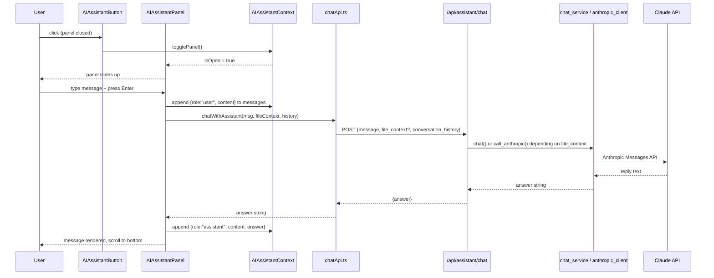
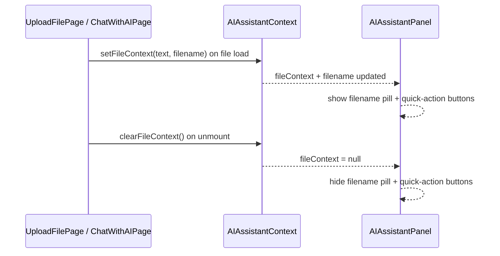

# Design Document: AI Assistant Widget

## Overview

This document describes the technical design for the persistent AI Assistant widget — a floating chat panel that is globally available across all authenticated pages of the Semantic Validator application. The widget provides both general-purpose AI conversation and context-aware file discussion, automatically picking up file content and analysis results from whichever page the user is currently on.

The design follows the existing dark space / neon design system (glass morphism cards, neon glow accents, Framer Motion animations) and reuses all existing shared services (`anthropic_client.py`, `chat_service.py`) and UI primitives (`GlassCard`, `NeonButton`, `sectionVariants`).

### Key Design Decisions

- **Global context via React Context API** — `AIAssistantContext` is mounted once inside `AuthProvider` and survives route changes, satisfying the session-scoped conversation requirement without any persistence layer.
- **Separate backend endpoint** (`/api/assistant/chat`) — keeps the new general-purpose mode cleanly separated from the existing file-only `/api/chat` endpoint, while reusing the same underlying services.
- **Context injection pattern** — pages call `setFileContext` / `setAnalysisResult` from the context on mount and `clearFileContext` on unmount; the widget reads these values passively, requiring no prop drilling.
- **No streaming** — responses are returned as a single payload to keep the implementation consistent with the existing chat endpoint and avoid SSE complexity.

---

## Architecture

```mermaid
graph TD
    subgraph "Browser (React)"
        AP[AuthProvider]
        AAP[AIAssistantProvider]
        AS[AppShell]
        PG[Pages\nChatWithAIPage\nUploadFilePage\nAnalyzeExcelPage]
        WG[AIAssistantWidget\nButton + Panel]
        CTX[AIAssistantContext\nfileContext · filename\nanalysisResult · messages\nisOpen · toggle]

        AP --> AAP
        AAP --> AS
        AS --> PG
        AS --> WG
        PG -- "setFileContext()\nsetAnalysisResult()" --> CTX
        WG -- "reads / writes" --> CTX
    end

    subgraph "Backend (FastAPI)"
        AR[assistant.py router\nPOST /api/assistant/chat]
        CS[chat_service.py\nchat()]
        AC[anthropic_client.py\ncall_anthropic()]
        CL[Claude API]

        AR --> CS
        AR --> AC
        CS --> AC
        AC --> CL
    end

    WG -- "POST /api/assistant/chat" --> AR
```

### Data Flow: Sending a Message



### Context Injection Flow (File Pages)



---

## Components and Interfaces

### Frontend Components

#### `AIAssistantContext` (`frontend/src/context/AIAssistantContext.tsx`)

The single source of truth for all assistant state. Mounted once inside `AuthProvider` in `App.tsx`.

```typescript
interface AIAssistantContextValue {
  // File context (set by pages)
  fileContext: string | null;
  filename: string | null;
  analysisResult: AnalysisResult | null;
  setFileContext: (text: string, filename: string) => void;
  clearFileContext: () => void;
  setAnalysisResult: (result: AnalysisResult) => void;

  // Conversation
  messages: Message[];
  addMessage: (msg: Message) => void;
  clearMessages: () => void;

  // Panel state
  isOpen: boolean;
  togglePanel: () => void;
  openPanel: () => void;
  closePanel: () => void;
}

interface Message {
  id: string;           // crypto.randomUUID()
  role: "user" | "assistant" | "error";
  content: string;
  timestamp: number;
}
```

The context clears `messages` when the auth token is removed (listening to `AuthContext.token` becoming `null`).

---

#### `AIAssistantButton` (`frontend/src/components/AIAssistant/AIAssistantButton.tsx`)

Floating action button, fixed at `bottom-6 right-6`, `z-50`.

**Visual spec:**
- 56×56 px circle, `bg-gradient-to-br from-purple-600 via-blue-600 to-cyan-500`
- Box shadow: `0 0 20px rgba(168,85,247,0.5), 0 0 40px rgba(59,130,246,0.3)`
- Animated pulse ring (absolutely positioned sibling, `neon-pulse` CSS class, `border-2 border-purple-500/50`, `rounded-full`, `scale-125`) — visible only when `!isOpen`
- Icon: `<Bot />` from `lucide-react` (24×24, white)
- Framer Motion `whileHover={{ scale: 1.1 }}`, `whileTap={{ scale: 0.95 }}`
- Unread badge: small red circle `top-0 right-0`, shows `messages.length` when `!isOpen && messages.length > 0`
- `aria-label="Open AI Assistant"` / `"Close AI Assistant"` toggled by `isOpen`

---

#### `AIAssistantPanel` (`frontend/src/components/AIAssistant/AIAssistantPanel.tsx`)

The chat panel. Fixed at `bottom-24 right-6`, `width: 380px`, `height: 520px`, `z-50`.

Wrapped in `AnimatePresence` with:
```typescript
initial={{ opacity: 0, y: 24, scale: 0.96 }}
animate={{ opacity: 1, y: 0, scale: 1 }}
exit={{ opacity: 0, y: 16, scale: 0.97 }}
transition={{ duration: 0.22, ease: "easeOut" }}
```

**Structure:**

```
┌─────────────────────────────────────────────────────┐
│ HEADER (GlassCard top section, border-b)            │
│  ✨ AI Assistant (gradient text purple→cyan)        │
│  [📄 filename.pdf] (pill, cyan border)  [✕ button] │
├─────────────────────────────────────────────────────┤
│ QUICK ACTIONS (only when fileContext active)        │
│  [✨ Summarize] [🔍 Analyze] [💡 Explain Results]  │
│  (pill buttons, glass bg, neon border on hover)     │
├─────────────────────────────────────────────────────┤
│ MESSAGE LIST (flex-1, overflow-y-auto, px-4 py-3)  │
│  aria-live="polite" aria-atomic="false"             │
│                                                     │
│  Assistant bubble: left-aligned                     │
│    glass bg, border border-white/10, rounded-2xl    │
│    rounded-tl-sm, max-w-[85%]                       │
│                                                     │
│  User bubble: right-aligned                         │
│    bg-gradient-to-br from-blue-600 to-blue-500      │
│    rounded-2xl rounded-tr-sm, max-w-[85%]           │
│                                                     │
│  Error bubble: left-aligned                         │
│    border border-red-500/30, text-red-400           │
│                                                     │
│  Typing indicator: left-aligned glass bubble        │
│    three dots with CSS bounce animation             │
├─────────────────────────────────────────────────────┤
│ INPUT AREA (border-t border-white/10, p-3)          │
│  <textarea> rows=1, auto-resize, max-h-24           │
│  glass bg, border border-white/10, rounded-xl       │
│  [Send →] NeonButton primary                        │
└─────────────────────────────────────────────────────┘
```

**Keyboard behaviour:**
- `Enter` (without Shift) → submit message
- `Shift+Enter` → insert newline
- On panel open → `useEffect` focuses textarea via `ref.current?.focus()`
- On panel close → focus returns to FAB via `buttonRef.current?.focus()`

**Welcome message:** On first render (empty messages), display a static assistant bubble: *"Hello! I'm your AI assistant. I can answer general questions about the Semantic Validator, or — when you have a file open — help you summarize, analyze, or explain its contents."*

---

#### `AIAssistantWidget` (`frontend/src/components/AIAssistant/index.tsx`)

Barrel export that renders both `AIAssistantButton` and `AIAssistantPanel` together, consuming `AIAssistantContext`. This is the single component added to `AppShell`.

```typescript
export function AIAssistantWidget() {
  const { isOpen, togglePanel, closePanel, messages, fileContext, ... } = useAIAssistant();
  return (
    <>
      <AIAssistantButton isOpen={isOpen} onClick={togglePanel} messageCount={messages.length} />
      <AnimatePresence>
        {isOpen && <AIAssistantPanel onClose={closePanel} />}
      </AnimatePresence>
    </>
  );
}
```

---

### Frontend API

#### `chatWithAssistant` (`frontend/src/api/chatApi.ts` — new export)

```typescript
export async function chatWithAssistant(
  message: string,
  fileContext: string | null,
  conversationHistory: ChatMessage[]
): Promise<string> {
  try {
    const response = await apiClient.post<{ answer: string }>("/api/assistant/chat", {
      message,
      file_context: fileContext ?? undefined,
      conversation_history: conversationHistory,
    });
    return response.data.answer;
  } catch (error) {
    const status = axios.isAxiosError(error) ? error.response?.status : undefined;
    if (status === 504) throw new Error("The AI took too long to respond. Please try again.");
    if (status === 502) throw new Error("The AI service is temporarily unavailable. Please try again.");
    if (!axios.isAxiosError(error) || !error.response) throw new Error("Network error. Please check your connection.");
    throw new Error("Something went wrong. Please try again.");
  }
}
```

Error messages are mapped here (not in the component) so they can be tested independently.

---

### Backend Components

#### `assistant.py` (`backend/app/routers/assistant.py`)

```python
from fastapi import APIRouter, Depends, HTTPException
from pydantic import BaseModel, Field
from typing import Optional

from app.dependencies import get_current_user
from app.models.schemas import AIServiceError, AITimeoutError, ChatMessage
from app.services import chat_service
from app.services.anthropic_client import call_anthropic

router = APIRouter()

GENERAL_SYSTEM_PROMPT = """You are a helpful AI assistant embedded in the Semantic Validator application.
The Semantic Validator helps users upload documents and Excel files, analyze their content for meaning,
tone, and clarity, deduplicate data, check text similarity, and chat with AI about their files.
Answer questions helpfully and concisely. If the user asks about their data or files, let them know
they can upload a file on the relevant page to get context-aware assistance."""

class AssistantChatRequest(BaseModel):
    message: str = Field(..., min_length=1)
    file_context: Optional[str] = None
    conversation_history: list[ChatMessage] = Field(default_factory=list)

class AssistantChatResponse(BaseModel):
    answer: str

@router.post("/api/assistant/chat", response_model=AssistantChatResponse)
async def assistant_chat(
    request: AssistantChatRequest,
    _user: dict = Depends(get_current_user),
) -> AssistantChatResponse:
    try:
        if request.file_context:
            answer = await chat_service.chat(
                request.message,
                request.file_context,
                request.conversation_history,
            )
        else:
            messages = [
                {"role": turn.role, "content": turn.content}
                for turn in request.conversation_history
            ]
            messages.append({"role": "user", "content": request.message})
            answer = await call_anthropic(
                messages=messages,
                system=GENERAL_SYSTEM_PROMPT,
                temperature=0.5,
            )
        return AssistantChatResponse(answer=answer)
    except AITimeoutError as exc:
        raise HTTPException(status_code=504, detail=str(exc))
    except AIServiceError as exc:
        raise HTTPException(status_code=502, detail=str(exc))
```

---

## Data Models

### Frontend

```typescript
// New type added to frontend/src/types.ts
export interface AssistantMessage {
  id: string;                              // crypto.randomUUID()
  role: "user" | "assistant" | "error";
  content: string;
  timestamp: number;                       // Date.now()
}

// Reuses existing ChatMessage for API calls (role: "user" | "assistant" only)
// AssistantMessage is the richer in-memory representation
```

### Backend

```python
# New schemas added to backend/app/models/schemas.py

class AssistantChatRequest(BaseModel):
    message: str = Field(..., min_length=1)
    file_context: Optional[str] = None          # None → general-purpose mode
    conversation_history: list[ChatMessage] = Field(default_factory=list)

class AssistantChatResponse(BaseModel):
    answer: str
```

### API Contract

**`POST /api/assistant/chat`**

Request:
```json
{
  "message": "What does this document say about revenue?",
  "file_context": "Q3 revenue grew by 12%...",   // optional, max 12000 chars enforced by chat_service
  "conversation_history": [
    { "role": "user", "content": "Hello" },
    { "role": "assistant", "content": "Hi! How can I help?" }
  ]
}
```

Response (200):
```json
{ "answer": "The document states that Q3 revenue grew by 12%..." }
```

Error responses:
| Status | Condition |
|--------|-----------|
| 401 | Missing or invalid JWT |
| 504 | Anthropic API timeout (> 60 s) |
| 502 | Anthropic API error |
| 422 | Validation error (empty message) |

---

## Correctness Properties

*A property is a characteristic or behavior that should hold true across all valid executions of a system — essentially, a formal statement about what the system should do. Properties serve as the bridge between human-readable specifications and machine-verifiable correctness guarantees.*

### Property 1: Button present on every authenticated route

*For any* valid application route rendered inside `AppShell`, the AI assistant floating action button SHALL be present in the DOM.

**Validates: Requirements 1.2**

---

### Property 2: Panel close preserves conversation

*For any* non-empty conversation history, opening the panel and then closing it SHALL leave the messages array unchanged (same length, same content, same order).

**Validates: Requirements 2.2, 6.1**

---

### Property 3: Non-empty message submission adds user turn

*For any* non-empty, non-whitespace string typed into the input, submitting it (via Enter or send button) SHALL immediately append a message with `role: "user"` and `content` equal to the trimmed input to the conversation, before the API response is received.

**Validates: Requirements 3.2, 3.4, 3.6**

---

### Property 4: API call carries full conversation context

*For any* message string and *any* conversation history array, calling `chatWithAssistant` SHALL invoke `POST /api/assistant/chat` with a body where `message` equals the input string and `conversation_history` equals the full history array.

**Validates: Requirements 4.1, 7.4**

---

### Property 5: Successful API response appended as assistant turn

*For any* string returned by the Chat_API, the assistant SHALL append a message with `role: "assistant"` and `content` equal to that string to the conversation.

**Validates: Requirements 4.2**

---

### Property 6: Non-2xx errors produce inline error messages

*For any* HTTP status code that is not 2xx (and not 504 or 502), the `chatWithAssistant` function SHALL throw an error with the message `"Something went wrong. Please try again."`, and the panel SHALL display that message inline in the conversation.

**Validates: Requirements 5.3**

---

### Property 7: File context forwarded with every message when active

*For any* non-null `fileContext` string and *any* message, submitting the message SHALL include `file_context` in the API request body equal to the active `fileContext` value.

**Validates: Requirements 9.2, 10.1, 11.1**

---

### Property 8: No file context → general-purpose mode

*For any* message submitted when `fileContext` is `null`, the API request body SHALL omit `file_context` (or set it to `undefined`/`null`), causing the backend to use the general-purpose system prompt.

**Validates: Requirements 9.5, 7.1, 7.2**

---

### Property 9: File context truncated to 12,000 characters

*For any* `file_context` string of length greater than 12,000 characters passed to the backend, the string forwarded to `call_anthropic` SHALL be truncated to exactly 12,000 characters.

**Validates: Requirements 9.6**

---

### Property 10: Quick-action buttons submit exact prompt text

*For any* active file context, clicking the "Summarize this file" quick-action button SHALL submit the message `"Please summarize this file."` and clicking the "Analyze this file" button SHALL submit `"Please analyze this file: describe its meaning, tone, clarity, and provide improvement suggestions."` — the submitted text SHALL be identical regardless of the file content.

**Validates: Requirements 10.4, 11.4**

---

### Property 11: Explain Results includes serialized AnalysisResult

*For any* `AnalysisResult` object set as context, clicking "Explain these results" SHALL submit a message that contains the serialized form of all four fields (`meaning`, `tone`, `clarity_score`, `suggestions`) of that result.

**Validates: Requirements 12.2, 12.5**

---

### Property 12: Conversation preserved across route changes

*For any* sequence of messages in the conversation and *any* route navigation event, the messages array SHALL be identical before and after navigation (same length, same content, same order).

**Validates: Requirements 2.3, 6.2**

---

**Property Reflection (redundancy check):**

- Properties 3 and 10 both test message submission, but 3 tests arbitrary input while 10 tests fixed prompt text — both are needed.
- Properties 7 and 8 are complementary (file context present vs. absent) — both needed.
- Properties 2 and 12 both test conversation preservation but under different triggers (close vs. navigate) — kept separate because the implementation paths differ (panel state vs. React Router).
- Property 4 subsumes the "message forwarded" aspect of 7, but 7 specifically tests the `file_context` field — kept separate.

---

## Error Handling

### Frontend Error Handling

| Scenario | Behaviour |
|----------|-----------|
| HTTP 504 | Inline error bubble: *"The AI took too long to respond. Please try again."* |
| HTTP 502 | Inline error bubble: *"The AI service is temporarily unavailable. Please try again."* |
| Any other non-2xx | Inline error bubble: *"Something went wrong. Please try again."* |
| Network failure (no response) | Inline error bubble: *"Network error. Please check your connection."* |
| Empty message submitted | Button disabled; no API call made |
| Duplicate submission while loading | Input + send button disabled during in-flight request |

Error messages are rendered as `AssistantMessage` entries with `role: "error"` — styled with a red-tinted glass bubble and a warning icon. After an error, the input and send button are re-enabled so the user can retry.

### Backend Error Handling

| Scenario | HTTP Status | Detail |
|----------|-------------|--------|
| Missing / invalid JWT | 401 | "Not authenticated" / "Invalid or expired token" |
| `AITimeoutError` from Anthropic client | 504 | Timeout message from exception |
| `AIServiceError` from Anthropic client | 502 | Error message from exception |
| Empty `message` field | 422 | Pydantic validation error |

The router does not catch generic `Exception` — unexpected errors propagate to FastAPI's default 500 handler, which is consistent with all other routers in the codebase.

---

## Testing Strategy

### Unit Tests (Example-Based)

**Frontend** (`frontend/src/__tests__/AIAssistant/`):

- `AIAssistantContext.test.tsx`
  - `setFileContext` stores text and filename
  - `clearFileContext` resets both to null
  - `setAnalysisResult` stores result
  - `clearMessages` empties the messages array
  - Logout (token → null) clears messages

- `AIAssistantButton.test.tsx`
  - Renders with `aria-label="Open AI Assistant"` when closed
  - Renders with `aria-label="Close AI Assistant"` when open
  - Pulse ring is present when panel is closed
  - Pulse ring is absent when panel is open
  - Unread badge shows message count when panel is closed and messages exist

- `AIAssistantPanel.test.tsx`
  - Welcome message shown when messages array is empty
  - Typing indicator shown while loading
  - Typing indicator hidden after response
  - Input and send button disabled while loading
  - Input and send button re-enabled after error
  - Filename pill visible when fileContext is active
  - Quick-action buttons visible when fileContext is active
  - "Explain Results" button visible only when analysisResult is set
  - Shift+Enter inserts newline without submitting
  - Focus moves to textarea on panel open
  - Focus returns to FAB on panel close
  - ARIA live region present on message list

- `chatApi.test.ts`
  - 504 → throws with correct message
  - 502 → throws with correct message
  - Network error → throws with correct message
  - Other non-2xx → throws with correct message

**Backend** (`backend/tests/test_assistant.py`):

- `POST /api/assistant/chat` without token → 401
- `POST /api/assistant/chat` with empty message → 422
- `POST /api/assistant/chat` with file_context → calls `chat_service.chat`
- `POST /api/assistant/chat` without file_context → calls `call_anthropic` with `GENERAL_SYSTEM_PROMPT`
- `AITimeoutError` → 504
- `AIServiceError` → 502

### Property-Based Tests

Property-based tests use **fast-check** (already available in the frontend ecosystem) for frontend properties and **Hypothesis** for backend properties.

Each test runs a minimum of **100 iterations**.

Tag format: `// Feature: ai-assistant, Property N: <property text>`

**Frontend property tests** (`frontend/src/__tests__/properties/aiAssistant.property.test.ts`):

```
// Feature: ai-assistant, Property 1: Button present on every authenticated route
fc.property(fc.constantFrom(...ALL_ROUTES), route => {
  render(<AppShell />, { route });
  expect(screen.getByLabelText(/AI Assistant/)).toBeInTheDocument();
})

// Feature: ai-assistant, Property 2: Panel close preserves conversation
fc.property(fc.array(messageArbitrary, { minLength: 1 }), messages => {
  // set messages in context, open panel, close panel, assert messages unchanged
})

// Feature: ai-assistant, Property 3: Non-empty message submission adds user turn
fc.property(fc.string({ minLength: 1 }).filter(s => s.trim().length > 0), msg => {
  // type msg, press Enter, assert messages[last].role === "user" && content === msg.trim()
})

// Feature: ai-assistant, Property 4: API call carries full conversation context
fc.property(fc.string({ minLength: 1 }), fc.array(chatMessageArbitrary), (msg, history) => {
  // call chatWithAssistant(msg, null, history), assert POST body matches
})

// Feature: ai-assistant, Property 5: Successful API response appended as assistant turn
fc.property(fc.string({ minLength: 1 }), answer => {
  // mock API to return answer, submit message, assert last message role=assistant content=answer
})

// Feature: ai-assistant, Property 6: Non-2xx errors produce inline error messages
fc.property(fc.integer({ min: 400, max: 599 }).filter(s => s !== 504 && s !== 502), status => {
  // mock API with status, assert error message "Something went wrong..."
})

// Feature: ai-assistant, Property 7: File context forwarded with every message when active
fc.property(fc.string({ minLength: 1 }), fc.string({ minLength: 1 }), (fileCtx, msg) => {
  // set fileContext, submit msg, assert POST body.file_context === fileCtx
})

// Feature: ai-assistant, Property 8: No file context → general-purpose mode
fc.property(fc.string({ minLength: 1 }), msg => {
  // no fileContext set, submit msg, assert POST body.file_context is undefined/null
})

// Feature: ai-assistant, Property 10: Quick-action buttons submit exact prompt text
fc.property(fc.string({ minLength: 1 }), fileCtx => {
  // set fileContext, click Summarize, assert submitted message === "Please summarize this file."
  // set fileContext, click Analyze, assert submitted message === expected analyze prompt
})

// Feature: ai-assistant, Property 11: Explain Results includes serialized AnalysisResult
fc.property(analysisResultArbitrary, result => {
  // set analysisResult, click Explain, assert submitted message contains all 4 fields
})

// Feature: ai-assistant, Property 12: Conversation preserved across route changes
fc.property(fc.array(messageArbitrary, { minLength: 1 }), fc.constantFrom(...ALL_ROUTES), (msgs, route) => {
  // set messages, navigate to route, assert messages unchanged
})
```

**Backend property tests** (`backend/tests/test_assistant_properties.py`):

```python
# Feature: ai-assistant, Property 9: File context truncated to 12,000 characters
@given(st.text(min_size=12001))
def test_file_context_truncated(file_context):
    # call build_prompt with long file_context, assert system prompt contains only first 12000 chars

# Feature: ai-assistant, Property 4 (backend): API call carries full conversation context
@given(st.text(min_size=1), st.lists(chat_message_strategy()))
def test_conversation_history_forwarded(message, history):
    # mock call_anthropic, call assistant endpoint, assert messages list matches history + new user turn
```

### Integration Tests

- End-to-end: authenticated user sends a message without file context → receives a non-empty string response (requires live Anthropic key, run in CI with `INTEGRATION=true` flag)
- File context mode: send message with file_context → response references file content
- Timeout simulation: mock `call_anthropic` to raise `AITimeoutError` → assert 504

### Accessibility Tests

- Automated axe-core scan on rendered `AIAssistantPanel` — zero violations
- Manual checklist: keyboard navigation, screen reader announcement of new messages, focus management on open/close
