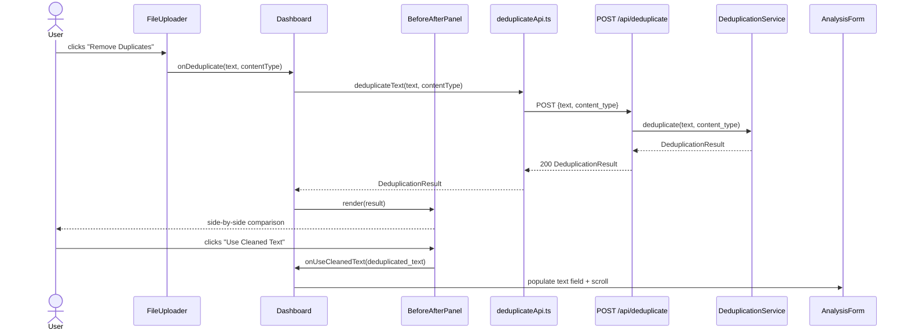
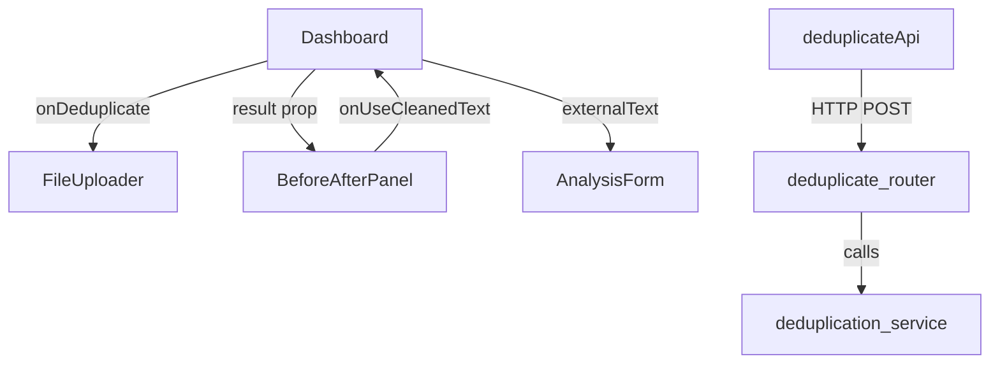

# Design Document: Duplicate Removal

## Overview

The Duplicate Removal feature adds a deduplication workflow to the existing Semantic Validator application. After a file is uploaded and text is extracted, users can click "Remove Duplicates" to send the extracted text to a new backend endpoint. The backend classifies the content as either `text` (PDF, DOCX, TXT) or `tabular` (Excel) and removes duplicate lines or rows using an O(n) dict-based algorithm. The result is returned to the frontend and displayed in a new `BeforeAfterPanel` component that renders the original and cleaned content side by side. Users can then push the cleaned text into the existing `AnalysisForm` with a single click.

The feature is additive: it introduces one new backend route, one new service module, two new Pydantic schemas, one new frontend API module, one new frontend component, and targeted extensions to `FileUploader`, `Dashboard`, and `types.ts`. No existing routes or components are modified in a breaking way.

---

## Architecture



### Component Interaction Diagram



---

## Components and Interfaces

### Backend

#### `POST /api/deduplicate` — `backend/app/routers/deduplicate.py`

```
POST /api/deduplicate
Content-Type: application/json

Request body: DeduplicateRequest
Response (200): DeduplicationResult
Response (422): { "detail": "<message>" }
```

The router validates the request with Pydantic, delegates to `deduplication_service`, and returns the result. It raises `HTTPException(422)` for unsupported MIME types.

#### `DeduplicationService` — `backend/app/services/deduplication_service.py`

Public interface:

```python
class DeduplicationService:
    def deduplicate(self, text: str, content_type: str) -> DeduplicationResult:
        ...
    def _deduplicate_lines(self, text: str) -> tuple[str, int]:
        ...
    def _deduplicate_rows(self, text: str) -> tuple[str, int]:
        ...
    def _normalize_line(self, line: str) -> str:
        ...
```

- `deduplicate` dispatches to `_deduplicate_lines` or `_deduplicate_rows` based on `content_type`.
- `_normalize_line` strips leading/trailing whitespace and collapses internal whitespace to a single space.
- Both private methods return `(deduplicated_text, duplicates_removed_count)`.

### Frontend

#### `deduplicateApi.ts` — `frontend/src/api/deduplicateApi.ts`

```typescript
export async function deduplicateText(
  text: string,
  contentType: string
): Promise<DeduplicationResult>
```

Follows the same axios pattern as `analyzeApi.ts` and `uploadApi.ts`: wraps errors into `Error` instances with the backend `detail` message.

#### `BeforeAfterPanel` — `frontend/src/components/BeforeAfterPanel.tsx`

Props:

```typescript
interface BeforeAfterPanelProps {
  result: DeduplicationResult;
  onUseCleanedText: (text: string) => void;
  isDeduplicating: boolean;
}
```

Renders:
- A summary badge showing the duplicate count (or a "no duplicates found" message when count is 0).
- Two side-by-side scrollable `<pre>` panels: "Original" (left) and "Cleaned" (right).
- A "Use Cleaned Text" button, disabled while `isDeduplicating` is true.

#### `FileUploader` extensions

New prop added:

```typescript
interface FileUploaderProps {
  onPopulate: (text: string) => void;
  onAnalyze: (text: string, fallbackTitle: string) => void;
  onDeduplicate: (text: string, contentType: string) => void;
  isAnalyzing: boolean;
  isDeduplicating: boolean;
}
```

New internal state slice added to `UploaderState` (via `deduplicationError`):

The success state renders a third button "Remove Duplicates". While `isDeduplicating` is true, all three buttons are disabled and the "Remove Duplicates" button shows a spinner. If deduplication fails, an inline error message is shown below the buttons without resetting the uploader state.

The component stores the uploaded file's `content_type` in the `UploadResult` (see Data Models) so it can pass it to `onDeduplicate`.

#### `Dashboard` extensions

New state:

```typescript
const [deduplicationResult, setDeduplicationResult] =
  useState<DeduplicationResult | null>(null);
const [isDeduplicating, setIsDeduplicating] = useState(false);
const [deduplicationError, setDeduplicationError] = useState<string | null>(null);
```

New handler:

```typescript
async function handleDeduplicate(text: string, contentType: string): Promise<void>
```

- Sets `isDeduplicating = true`, clears previous result/error.
- Calls `deduplicateText(text, contentType)`.
- On success: sets `deduplicationResult`, clears error.
- On failure: sets `deduplicationError` (passed back to `FileUploader`), clears result.
- Always sets `isDeduplicating = false`.

`handlePopulate` and file re-upload clear `deduplicationResult` (hiding `BeforeAfterPanel`).

`handleUseCleanedText(text)` calls `handlePopulate(text)` and scrolls `analysisFormRef` into view.

---

## Data Models

### Backend Pydantic Schemas (additions to `schemas.py`)

```python
class DeduplicateRequest(BaseModel):
    text: str
    content_type: str

class DeduplicationResult(BaseModel):
    original_text: str
    deduplicated_text: str
    duplicates_removed: int
    file_type_category: Literal["text", "tabular"]
```

### Frontend TypeScript Types (additions to `types.ts`)

```typescript
export interface DeduplicationResult {
  original_text: string;
  deduplicated_text: string;
  duplicates_removed: number;
  file_type_category: "text" | "tabular";
}

// UploadResult extended with content_type
export interface UploadResult {
  extracted_text: string;
  filename: string;
  content_type: string;   // added
}
```

`UploaderState` success variant already carries `UploadResult`, so `content_type` is available to `FileUploader` without additional state.

### Backend `UploadResult` schema extension

```python
class UploadResult(BaseModel):
    extracted_text: str
    filename: str
    content_type: str   # added
```

The upload router passes `file.content_type or ""` into this field.

---

## Correctness Properties

*A property is a characteristic or behavior that should hold true across all valid executions of a system — essentially, a formal statement about what the system should do. Properties serve as the bridge between human-readable specifications and machine-verifiable correctness guarantees.*


### Property 1: Response structure completeness

*For any* valid (text, supported_mime_type) pair passed to the deduplication service, the returned result SHALL contain all four fields: `original_text` equal to the input text, `deduplicated_text` as a string, `duplicates_removed` as a non-negative integer, and `file_type_category` as either `"text"` or `"tabular"`.

**Validates: Requirements 2.2**

---

### Property 2: MIME type classification

*For any* supported MIME type string, the deduplication service SHALL classify Excel MIME types (`application/vnd.openxmlformats-officedocument.spreadsheetml.sheet`, `application/vnd.ms-excel`) as `"tabular"` and all other supported MIME types (`text/plain`, `application/pdf`, `application/vnd.openxmlformats-officedocument.wordprocessingml.document`) as `"text"`.

**Validates: Requirements 2.3, 2.4**

---

### Property 3: Unsupported MIME type rejection

*For any* string that is not one of the five supported MIME types, the deduplication service SHALL raise an error (and the endpoint SHALL return HTTP 422).

**Validates: Requirements 2.5**

---

### Property 4: Text deduplication correctness

*For any* text input processed as `text` content type, the `deduplicated_text` in the result SHALL contain no two lines whose normalized forms (leading/trailing whitespace stripped, internal whitespace collapsed to a single space) are identical, and the lines that do appear SHALL be in the same relative order as their first occurrence in the original input.

**Validates: Requirements 3.2, 3.3, 3.4, 3.6**

---

### Property 5: Blank line preservation

*For any* text input containing N blank lines (lines whose normalized form is the empty string), the `deduplicated_text` SHALL also contain exactly N blank lines.

**Validates: Requirements 3.5**

---

### Property 6: Row deduplication correctness

*For any* tabular text input processed as an Excel MIME type, the `deduplicated_text` in the result SHALL contain no two rows whose stripped forms (leading/trailing whitespace removed) are identical, and the rows that do appear SHALL be in the same relative order as their first occurrence in the original input.

**Validates: Requirements 4.2, 4.3, 4.4, 4.6**

---

### Property 7: BeforeAfterPanel renders correct content

*For any* `DeduplicationResult`, the rendered `BeforeAfterPanel` SHALL display `original_text` in a panel labeled "Original" and `deduplicated_text` in a panel labeled "Cleaned".

**Validates: Requirements 5.1**

---

### Property 8: BeforeAfterPanel displays correct duplicate count

*For any* `DeduplicationResult` with `duplicates_removed > 0`, the rendered `BeforeAfterPanel` SHALL display the exact value of `duplicates_removed` in the summary badge.

**Validates: Requirements 5.2**

---

### Property 9: "Use Cleaned Text" passes deduplicated text

*For any* `DeduplicationResult`, when the user activates the "Use Cleaned Text" button in `BeforeAfterPanel`, the `onUseCleanedText` callback SHALL be invoked with exactly `result.deduplicated_text` as its argument.

**Validates: Requirements 6.2**

---

## Error Handling

### Backend

| Scenario | HTTP Status | Detail message |
|---|---|---|
| Unsupported MIME type | 422 | `"Unsupported content type: {content_type}. Accepted types: pdf, docx, txt, xls, xlsx."` |
| Empty text | 200 | Returns result with `duplicates_removed: 0`, `deduplicated_text == original_text` |
| Unexpected server error | 500 | `"An unexpected error occurred during deduplication."` |

The router wraps the service call in a `try/except` block. `UnsupportedContentTypeError` (a new exception class in `deduplication_service.py`) maps to 422. All other exceptions map to 500.

### Frontend

`deduplicateApi.ts` follows the same error-handling pattern as `analyzeApi.ts`:
- No network response → `"Service unavailable. Please check your connection and try again."`
- Response with `detail` field → re-throws with that message
- Other axios errors → re-throws as-is

`FileUploader` catches errors from `onDeduplicate` and stores them in a local `deduplicationError` string state. The error is displayed inline below the action buttons. The error is cleared when the user clicks "Remove Duplicates" again or uploads a new file.

`Dashboard` propagates the error back to `FileUploader` via a `deduplicationError` prop (string | null).

---

## Testing Strategy

### Unit Tests

**Backend (`backend/tests/test_deduplicate.py`)**

- `DeduplicationService._normalize_line`: specific examples (empty string, all-whitespace, internal spaces, tabs)
- `DeduplicationService._deduplicate_lines`: empty input, single line, all-unique lines, all-duplicate lines, mixed, blank line preservation
- `DeduplicationService._deduplicate_rows`: same cases for tabular content
- `DeduplicationService.deduplicate`: MIME type dispatch (each of the 5 types), unsupported MIME type raises error
- Router `POST /api/deduplicate`: valid request returns 200, unsupported MIME returns 422, empty text returns 200 with zero count

**Frontend (`frontend/src/__tests__/BeforeAfterPanel.test.tsx`)**

- Renders "Original" and "Cleaned" labels
- Renders duplicate count badge
- Renders "no duplicates found" message when count is 0
- "Use Cleaned Text" button is present and enabled by default
- "Use Cleaned Text" button is disabled when `isDeduplicating=true`
- Clicking "Use Cleaned Text" calls `onUseCleanedText` with `deduplicated_text`

**Frontend (`frontend/src/__tests__/FileUploader.test.tsx` extensions)**

- "Remove Duplicates" button present in success state
- All buttons disabled when `isDeduplicating=true`
- Inline error shown when `deduplicationError` prop is set

### Property-Based Tests

The deduplication service logic is well-suited for property-based testing because it is a pure function over text inputs with universal correctness invariants. The property-based testing library used is **[Hypothesis](https://hypothesis.readthedocs.io/)** for Python (backend) and **[fast-check](https://fast-check.dev/)** for TypeScript (frontend).

Each property test runs a minimum of **100 iterations**.

**Backend property tests (`backend/tests/test_deduplicate_properties.py`)**

Each test is tagged with a comment referencing the design property:
`# Feature: duplicate-removal, Property N: <property_text>`

- **Property 1** — `test_response_structure_completeness`: Generate random `(text, mime_type)` from supported types; assert result has all four fields with correct types and `original_text == input_text`.
- **Property 2** — `test_mime_type_classification`: For each supported MIME type, generate random text; assert `file_type_category` matches expected classification.
- **Property 3** — `test_unsupported_mime_raises`: Generate arbitrary strings not in the supported set; assert `UnsupportedContentTypeError` is raised.
- **Property 4** — `test_text_deduplication_no_duplicate_normalized_lines`: Generate random multi-line text; after deduplication, assert no two lines share the same normalized form, and lines appear in original-order.
- **Property 5** — `test_blank_line_preservation`: Generate random text with a random number of blank lines interspersed; assert blank line count is preserved after deduplication.
- **Property 6** — `test_row_deduplication_no_duplicate_stripped_rows`: Generate random tab-separated multi-line text; after deduplication with Excel MIME type, assert no two rows share the same stripped form, in original order.

**Frontend property tests (`frontend/src/__tests__/BeforeAfterPanel.property.test.tsx`)**

- **Property 7** — `test_renders_correct_content`: Generate random `DeduplicationResult` objects; assert rendered output contains `original_text` under "Original" and `deduplicated_text` under "Cleaned".
- **Property 8** — `test_displays_correct_count`: Generate random `DeduplicationResult` with `duplicates_removed > 0`; assert the count value appears in the rendered badge.
- **Property 9** — `test_use_cleaned_text_callback`: Generate random `DeduplicationResult`; simulate button click; assert callback receives exactly `deduplicated_text`.
