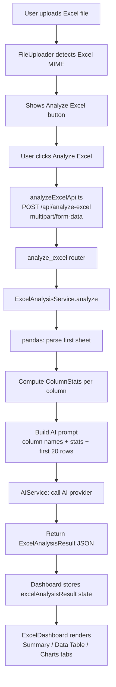

# Design Document: Excel Analysis

## Overview

This feature adds dedicated Excel analysis to the Semantic Validator application. When a user uploads an `.xlsx` or `.xls` file, a new "Analyze Excel" button appears in the `FileUploader`. Clicking it sends the file to a new `POST /api/analyze-excel` endpoint, which uses `pandas` to parse the spreadsheet, computes per-column statistics, generates an AI narrative summary, and returns a structured JSON response. The frontend renders the results in a new `ExcelDashboard` component with three tabs: Summary, Data Table, and Charts.

The feature is additive — it does not modify existing upload, analyze, deduplicate, or download flows. It reuses the existing AI service pattern, Tailwind design language, and axios API layer.

---

## Architecture



**Data flow summary:**
1. `FileUploader` detects Excel MIME type and conditionally renders the "Analyze Excel" button.
2. `Dashboard` calls `analyzeExcelApi` and stores the result in `excelAnalysisResult` state.
3. When `excelAnalysisResult` is set, `Dashboard` renders `ExcelDashboard` in place of `BeforeAfterPanel` / `ResultsPanel`.
4. `ExcelDashboard` is a pure display component — it receives the result as a prop and manages only local UI state (active tab, sort, filter, page).

---

## Components and Interfaces

### Backend

#### `ExcelAnalysisService` (`backend/app/services/excel_analysis_service.py`)

```python
class ExcelAnalysisService:
    MAX_FILE_SIZE: int = 10 * 1024 * 1024  # 10 MB
    EXCEL_MIME_TYPES: frozenset[str] = frozenset({
        "application/vnd.openxmlformats-officedocument.spreadsheetml.sheet",
        "application/vnd.ms-excel",
    })

    async def analyze(
        self,
        filename: str,
        content_type: str,
        data: bytes,
    ) -> ExcelAnalysisResult:
        """
        Parse the Excel file, compute statistics, call AI for summary.
        Raises ExcelParseError on corrupt/unsupported files.
        Raises FileTooLargeError if len(data) > MAX_FILE_SIZE.
        Raises UnsupportedFileTypeError if content_type not in EXCEL_MIME_TYPES.
        AI errors are caught and ai_summary is set to None (graceful degradation).
        """
```

Internal helpers:
- `_parse(data: bytes) -> pd.DataFrame` — reads first sheet with `pd.read_excel`
- `_compute_stats(df: pd.DataFrame) -> list[ColumnStats]` — iterates columns
- `_infer_dtype(series: pd.Series) -> Literal["numeric","text","date","boolean","mixed"]`
- `_build_ai_prompt(df: pd.DataFrame, stats: list[ColumnStats]) -> str`
- `_normalize_headers(df: pd.DataFrame) -> pd.DataFrame` — renames unnamed columns to `Column_N`

#### Router (`backend/app/routers/analyze_excel.py`)

```
POST /api/analyze-excel
Content-Type: multipart/form-data
Field: file (UploadFile)

Success: 200 ExcelAnalysisResult
Errors:
  422 — file too large, corrupt file, wrong MIME type
  502 — AI provider error
  504 — AI provider timeout
```

#### Pydantic Schemas (additions to `backend/app/models/schemas.py`)

```python
class NumericStats(BaseModel):
    min: float
    max: float
    mean: float

class ColumnStats(BaseModel):
    name: str
    dtype: Literal["numeric", "text", "date", "boolean", "mixed"]
    missing_count: int
    unique_count: int
    numeric_stats: NumericStats | None = None  # present only for numeric columns

class ExcelAnalysisResult(BaseModel):
    headers: list[str]
    rows: list[list[Any]]          # scalar values; None for missing cells
    column_stats: list[ColumnStats]
    duplicate_row_count: int
    ai_summary: str | None
```

### Frontend

#### `analyzeExcelApi.ts` (`frontend/src/api/analyzeExcelApi.ts`)

```typescript
export async function analyzeExcel(file: File): Promise<ExcelAnalysisResult> {
  const formData = new FormData();
  formData.append("file", file);
  try {
    const response = await axios.post<ExcelAnalysisResult>(
      "/api/analyze-excel",
      formData,
      { headers: { "Content-Type": "multipart/form-data" } }
    );
    return response.data;
  } catch (error) {
    if (axios.isAxiosError(error)) {
      if (!error.response) throw new Error("Network error — please check your connection and try again.");
      throw new Error(
        (error.response.data as { detail?: string })?.detail ?? "An unexpected error occurred."
      );
    }
    throw error;
  }
}
```

#### New Types (`frontend/src/types.ts` additions)

```typescript
export interface NumericStats {
  min: number;
  max: number;
  mean: number;
}

export interface ColumnStats {
  name: string;
  dtype: "numeric" | "text" | "date" | "boolean" | "mixed";
  missing_count: number;
  unique_count: number;
  numeric_stats?: NumericStats;
}

export interface ExcelAnalysisResult {
  headers: string[];
  rows: (string | number | boolean | null)[][];
  column_stats: ColumnStats[];
  duplicate_row_count: number;
  ai_summary: string | null;
}

export type ExcelAnalysisState =
  | { status: "idle" }
  | { status: "loading" }
  | { status: "success"; result: ExcelAnalysisResult }
  | { status: "error"; message: string };
```

#### `FileUploader` extension

New props added to `FileUploaderProps`:

```typescript
onAnalyzeExcel?: (file: File) => void;
isAnalyzingExcel?: boolean;
```

The "Analyze Excel" button is rendered inside the success state block, conditionally on the uploaded file's MIME type being an Excel type:

```typescript
const EXCEL_MIME_TYPES = new Set([
  "application/vnd.openxmlformats-officedocument.spreadsheetml.sheet",
  "application/vnd.ms-excel",
]);

// Inside success state, after existing buttons:
{onAnalyzeExcel && EXCEL_MIME_TYPES.has(state.result.content_type) && (
  <button
    type="button"
    disabled={isAnalyzingExcel || isAnalyzing || isDeduplicating}
    onClick={() => onAnalyzeExcel(uploadedFile)}
    ...
  >
    {isAnalyzingExcel ? "Analyzing..." : "Analyze Excel"}
  </button>
)}
```

Because `FileUploader` currently stores only the `UploadResult` (not the original `File` object), the component will also store the raw `File` in a `useState<File | null>` ref alongside the upload result so it can be passed to `onAnalyzeExcel`.

#### `Dashboard` extension

New state:

```typescript
const [excelAnalysisState, setExcelAnalysisState] = useState<ExcelAnalysisState>({ status: "idle" });
```

New handler:

```typescript
async function handleAnalyzeExcel(file: File) {
  setDeduplicationResult(null);   // clear BeforeAfterPanel
  setState({ status: "idle" });   // clear ResultsPanel
  setExcelAnalysisState({ status: "loading" });
  try {
    const result = await analyzeExcel(file);
    setExcelAnalysisState({ status: "success", result });
  } catch (err) {
    setExcelAnalysisState({
      status: "error",
      message: err instanceof Error ? err.message : "Excel analysis failed.",
    });
  }
}
```

Render logic: when `excelAnalysisState.status !== "idle"`, render `<ExcelDashboard>` below the uploader card instead of `<BeforeAfterPanel>` and the content grid.

#### `ExcelDashboard` (`frontend/src/components/ExcelDashboard.tsx`)

```typescript
interface ExcelDashboardProps {
  state: ExcelAnalysisState;          // "loading" | "success" | "error"
  onDismissError: () => void;
}
```

Internal state:
- `activeTab: "summary" | "table" | "charts"` — default `"summary"`
- `sortColumn: string | null`, `sortDirection: "asc" | "desc"`
- `filterText: string`
- `page: number` — 1-based, resets on sort/filter change

Tab content:
- **Summary tab**: stats cards (rows, columns, missing values, duplicates) + AI summary card
- **Data Table tab**: filterable, sortable, paginated table (100 rows/page)
- **Charts tab**: missing-values bar chart, optional line chart (first numeric column), optional pie chart (first text column with ≤10 unique values)

---

## Data Models

### API Request

```
POST /api/analyze-excel
Content-Type: multipart/form-data

file: <binary Excel file>
```

### API Response (HTTP 200)

```json
{
  "headers": ["Name", "Age", "Column_3"],
  "rows": [
    ["Alice", 30, null],
    ["Bob", 25, "foo"]
  ],
  "column_stats": [
    {
      "name": "Name",
      "dtype": "text",
      "missing_count": 0,
      "unique_count": 2,
      "numeric_stats": null
    },
    {
      "name": "Age",
      "dtype": "numeric",
      "missing_count": 0,
      "unique_count": 2,
      "numeric_stats": { "min": 25.0, "max": 30.0, "mean": 27.5 }
    },
    {
      "name": "Column_3",
      "dtype": "mixed",
      "missing_count": 1,
      "unique_count": 1,
      "numeric_stats": null
    }
  ],
  "duplicate_row_count": 0,
  "ai_summary": "The dataset contains 2 rows and 3 columns..."
}
```

### Error Responses

| HTTP | Condition | `detail` message |
|------|-----------|-----------------|
| 422 | File > 10 MB | `"File exceeds the 10 MB size limit."` |
| 422 | Corrupt / unreadable | `"Could not parse the Excel file. Ensure it is a valid .xlsx or .xls file."` |
| 422 | Wrong MIME type | `"Only Excel files (.xlsx, .xls) are supported."` |
| 502 | AI provider non-200 | `"AI provider error."` |
| 504 | AI provider timeout | `"AI provider timed out."` |

### dtype Inference Rules

| Condition | dtype |
|-----------|-------|
| `pd.api.types.is_numeric_dtype` | `"numeric"` |
| `pd.api.types.is_datetime64_any_dtype` | `"date"` |
| `pd.api.types.is_bool_dtype` | `"boolean"` |
| All non-null values are strings | `"text"` |
| Mixed types | `"mixed"` |

### Unnamed Column Naming

pandas names unnamed columns `Unnamed: N` (0-based). The service renames these to `Column_{N+1}` (1-based) before building the response.

---

## Correctness Properties

*A property is a characteristic or behavior that should hold true across all valid executions of a system — essentially, a formal statement about what the system should do. Properties serve as the bridge between human-readable specifications and machine-verifiable correctness guarantees.*

### Property 1: Excel button visibility matches MIME type

*For any* uploaded file, the "Analyze Excel" button SHALL be visible if and only if the file's MIME type is an Excel type (`application/vnd.openxmlformats-officedocument.spreadsheetml.sheet` or `application/vnd.ms-excel`), and SHALL NOT be visible for any other MIME type.

**Validates: Requirements 1.1, 1.2**

---

### Property 2: Parse round-trip preserves tabular structure

*For any* valid DataFrame written to an Excel byte buffer, parsing that buffer with `ExcelAnalysisService._parse` SHALL return a DataFrame whose column names and row values are equivalent to the original (after header normalization).

**Validates: Requirements 2.1, 2.5**

---

### Property 3: Multi-sheet files use only the first sheet

*For any* Excel file with two or more sheets containing different data, `ExcelAnalysisService.analyze` SHALL return headers and rows that correspond exclusively to the first sheet's data.

**Validates: Requirements 2.2**

---

### Property 4: Invalid bytes produce a parse error

*For any* byte sequence that is not a valid Excel file, `ExcelAnalysisService._parse` SHALL raise `ExcelParseError`.

**Validates: Requirements 2.4**

---

### Property 5: Column statistics completeness and correctness

*For any* valid DataFrame, every entry in the `column_stats` list returned by `ExcelAnalysisService._compute_stats` SHALL have a `dtype`, `missing_count` equal to the actual number of null/NaN values in that column, and `unique_count` equal to the number of distinct non-null values in that column.

**Validates: Requirements 3.1**

---

### Property 6: Numeric stats are present and correct for numeric columns

*For any* DataFrame column whose inferred dtype is `"numeric"`, the `numeric_stats` field SHALL be non-null and its `min`, `max`, and `mean` values SHALL equal the actual minimum, maximum, and mean of the column's non-null values, each rounded to 2 decimal places.

**Validates: Requirements 3.3**

---

### Property 7: Duplicate row count matches pandas computation

*For any* DataFrame, the `duplicate_row_count` in the response SHALL equal `df.duplicated().sum()`.

**Validates: Requirements 3.2**

---

### Property 8: AI unavailability does not suppress table data

*For any* valid Excel file, when the AI provider raises any exception, `ExcelAnalysisService.analyze` SHALL still return a result with valid `headers`, `rows`, and `column_stats`, and `ai_summary` SHALL be `None`.

**Validates: Requirements 4.4**

---

### Property 9: Non-Excel MIME type always returns 422

*For any* MIME type that is not an Excel type, `POST /api/analyze-excel` SHALL return HTTP 422 with the message `"Only Excel files (.xlsx, .xls) are supported."`.

**Validates: Requirements 5.3**

---

### Property 10: Summary card displays all four statistics correctly

*For any* `ExcelAnalysisResult`, the rendered `ExcelDashboard` Summary tab SHALL display the correct total row count, total column count, total missing value count (sum of all `missing_count` values), and `duplicate_row_count`.

**Validates: Requirements 6.1**

---

### Property 11: AI summary text is displayed when present

*For any* non-null `ai_summary` string in an `ExcelAnalysisResult`, the rendered `ExcelDashboard` Summary tab SHALL display that exact string.

**Validates: Requirements 6.2**

---

### Property 12: Data table pagination is correct

*For any* dataset with N rows, the Data Table tab SHALL display exactly `min(N, 100)` rows on the first page, and SHALL show pagination controls if and only if `N > 100`.

**Validates: Requirements 7.1**

---

### Property 13: Sort order invariant

*For any* dataset and any column, after clicking that column header to sort ascending, every adjacent pair of displayed rows `(r_i, r_{i+1})` SHALL satisfy `r_i[col] <= r_{i+1}[col]`; after clicking again for descending, `r_i[col] >= r_{i+1}[col]`.

**Validates: Requirements 7.2**

---

### Property 14: Filter inclusion invariant

*For any* dataset and any non-empty search string, every row displayed in the Data Table SHALL contain the search string (case-insensitive) in at least one cell value.

**Validates: Requirements 7.3**

---

### Property 15: Missing-values bar chart data matches column stats

*For any* `ExcelAnalysisResult`, the data passed to the bar chart in the Charts tab SHALL have one entry per column whose value equals that column's `missing_count`.

**Validates: Requirements 8.1**

---

### Property 16: Three tabs are always present

*For any* valid `ExcelAnalysisResult`, the rendered `ExcelDashboard` SHALL contain exactly the tabs "Summary", "Data Table", and "Charts".

**Validates: Requirements 9.2**

---

### Property 17: Active tab shows only its own content

*For any* tab selection, the `ExcelDashboard` SHALL render the content section for the selected tab and SHALL NOT render the content sections for the other two tabs.

**Validates: Requirements 9.3**

---

### Property 18: Error banner displays endpoint error messages

*For any* error message string returned by the endpoint, the `ExcelDashboard` error state SHALL display that exact string in the error banner.

**Validates: Requirements 10.1**

---

## Property Reflection

After reviewing all 18 properties:

- **Properties 1** covers both 1.1 and 1.2 (button visibility is a single boolean predicate over MIME type) — no redundancy.
- **Properties 2 and 3** are distinct: Property 2 tests data fidelity for single-sheet files; Property 3 tests sheet selection for multi-sheet files.
- **Properties 5 and 6** are complementary: Property 5 covers all columns (dtype, missing, unique); Property 6 adds numeric-specific stats only for numeric columns.
- **Properties 10 and 11** are distinct: Property 10 tests the four numeric stats cards; Property 11 tests the AI summary text display.
- **Properties 13 and 14** both test Data Table behavior but are independent (sort vs. filter).
- **Property 12** (pagination) is independent of 13/14 (sort/filter).
- No properties are logically redundant after reflection. All 18 are retained.

---

## Error Handling

### Backend

| Layer | Error | HTTP | Behaviour |
|-------|-------|------|-----------|
| Router | File > 10 MB | 422 | Checked before parsing |
| Router | Wrong MIME type | 422 | Checked before parsing |
| `ExcelAnalysisService` | `ExcelParseError` | 422 | Raised by `_parse`, caught in router |
| `ExcelAnalysisService` | `AITimeoutError` | 504 | Re-raised from router |
| `ExcelAnalysisService` | `AIServiceError` | 502 | Re-raised from router |
| `ExcelAnalysisService` | Any other AI error | graceful | `ai_summary = None`, response still 200 |

The router handler pattern:

```python
@router.post("/api/analyze-excel", response_model=ExcelAnalysisResult)
async def analyze_excel(file: UploadFile = File(...)):
    data = await file.read()
    if len(data) > ExcelAnalysisService.MAX_FILE_SIZE:
        raise HTTPException(status_code=422, detail="File exceeds the 10 MB size limit.")
    if file.content_type not in ExcelAnalysisService.EXCEL_MIME_TYPES:
        raise HTTPException(status_code=422, detail="Only Excel files (.xlsx, .xls) are supported.")
    try:
        return await excel_analysis_service.analyze(file.filename, file.content_type, data)
    except ExcelParseError as e:
        raise HTTPException(status_code=422, detail=str(e))
    except AITimeoutError:
        raise HTTPException(status_code=504, detail="AI provider timed out.")
    except AIServiceError:
        raise HTTPException(status_code=502, detail="AI provider error.")
```

### Frontend

- Network errors → `"Network error — please check your connection and try again."`
- Endpoint errors → display `detail` field from response body
- Error state in `ExcelDashboard` shows a dismissible banner; dismissing calls `onDismissError` which resets `excelAnalysisState` to `{ status: "idle" }` in `Dashboard`

---

## Testing Strategy

### Unit Tests (pytest)

- `ExcelAnalysisService._parse`: valid xlsx bytes → correct DataFrame; corrupt bytes → `ExcelParseError`
- `ExcelAnalysisService._normalize_headers`: unnamed columns renamed to `Column_N`
- `ExcelAnalysisService._infer_dtype`: each dtype category with representative Series
- `ExcelAnalysisService._compute_stats`: missing_count, unique_count, numeric_stats correctness
- Router: wrong MIME type → 422; file too large → 422; AI timeout → 504; AI error → 502; AI unavailable → 200 with `ai_summary=null`

### Property-Based Tests (pytest + Hypothesis)

The project already uses `hypothesis` (present in `requirements.txt`). Each property test runs a minimum of 100 iterations.

Tag format: `# Feature: excel-analysis, Property N: <property_text>`

**Backend properties (Hypothesis):**

| Property | Strategy |
|----------|----------|
| P2: Parse round-trip | `st.lists(st.dictionaries(...))` → DataFrame → Excel bytes → parse → compare |
| P4: Invalid bytes → parse error | `st.binary()` filtered to non-Excel magic bytes |
| P5: Column stats completeness | Random DataFrames via `st.data()` |
| P6: Numeric stats correctness | DataFrames with numeric columns |
| P7: Duplicate row count | DataFrames with injected duplicate rows |
| P8: AI unavailability | Any valid Excel + mocked AI raising exception |
| P9: Non-Excel MIME → 422 | `st.text()` filtered to non-Excel MIME types |

**Frontend properties (Vitest + fast-check):**

The project already uses `fast-check` (present in `package.json`). Each property test runs a minimum of 100 iterations.

| Property | Strategy |
|----------|----------|
| P1: Button visibility | `fc.record({ content_type: fc.string() })` |
| P10: Summary card stats | `fc.record(ExcelAnalysisResult shape)` |
| P11: AI summary display | `fc.string()` for ai_summary |
| P12: Pagination | `fc.integer({ min: 0, max: 500 })` for row count |
| P13: Sort order | Random rows + random column index |
| P14: Filter inclusion | Random rows + random search string |
| P15: Bar chart data | Random column_stats |
| P16: Three tabs present | Any valid ExcelAnalysisResult |
| P17: Active tab isolation | `fc.constantFrom("summary", "table", "charts")` |
| P18: Error banner | `fc.string()` for error message |

### Integration Tests

- `POST /api/analyze-excel` with a real small `.xlsx` file → 200 with correct schema
- `POST /api/analyze-excel` with a PDF → 422
- AI provider timeout (mocked) → 504
- AI provider error (mocked) → 502

### Dependencies to Add

**Backend (`requirements.txt`):**
```
pandas
openpyxl   # already present — used by pandas for xlsx
```

**Frontend (`package.json` dependencies):**
```json
"recharts": "^2.12.0",
"@types/recharts": "^1.8.29"
```
