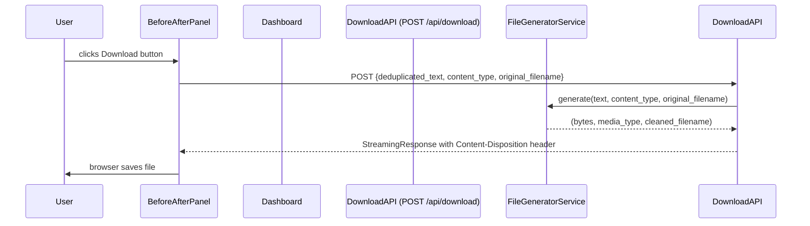

# Design Document: File Output

## Overview

This feature adds file generation and download capability to the deduplication flow. After deduplication completes, the user can click a "Download Cleaned File" button in the `BeforeAfterPanel`. The frontend sends the deduplicated text, original `content_type`, and original filename to a new `POST /api/download` endpoint. The backend rebuilds a cleaned file in the appropriate format and returns it as a binary attachment. The cleaned file is named `cleaned_<original_filename>`. PDF uploads fall back to TXT output since PDF is a read-only format.

All required libraries (`python-docx`, `openpyxl`) are already present in `requirements.txt`. No new npm packages are needed on the frontend.

---

## Architecture



### Data flow for filename threading

```mermaid
flowchart LR
    FileUploader -->|onDeduplicate(text, contentType, filename)| Dashboard
    Dashboard -->|stores originalFilename in state| Dashboard
    Dashboard -->|originalFilename prop| BeforeAfterPanel
    BeforeAfterPanel -->|POST /api/download| DownloadEndpoint
```

---

## Components and Interfaces

### Backend: `DownloadRequest` schema

```python
class DownloadRequest(BaseModel):
    deduplicated_text: str
    content_type: str
    original_filename: str
```

### Backend: `FileGeneratorService`

```python
class FileGenerationError(Exception):
    """Raised when a file builder fails."""

class FileGeneratorService:
    def generate(
        self, text: str, content_type: str, original_filename: str
    ) -> tuple[bytes, str, str]:
        """
        Returns (file_bytes, media_type, cleaned_filename).
        Raises FileGenerationError on builder failure.
        Raises UnsupportedContentTypeError for unknown MIME types.
        """
```

Format dispatch table:

| `content_type` | Builder | Output `media_type` | Filename rule |
|---|---|---|---|
| `text/plain` | `_build_txt` | `text/plain; charset=utf-8` | `cleaned_<original_filename>` |
| `application/pdf` | `_build_txt` (fallback) | `text/plain; charset=utf-8` | `cleaned_<stem>.txt` |
| `application/vnd.openxmlformats-officedocument.wordprocessingml.document` | `_build_docx` | `application/vnd.openxmlformats-officedocument.wordprocessingml.document` | `cleaned_<original_filename>` |
| `application/vnd.openxmlformats-officedocument.spreadsheetml.sheet` | `_build_xlsx` | `application/vnd.openxmlformats-officedocument.spreadsheetml.sheet` | `cleaned_<original_filename>` |
| `application/vnd.ms-excel` | `_build_xlsx` | `application/vnd.openxmlformats-officedocument.spreadsheetml.sheet` | `cleaned_<original_filename>` |

### Backend: `POST /api/download` router

```python
@router.post("/api/download")
async def download(request: DownloadRequest) -> StreamingResponse:
    # calls file_generator_service.generate(...)
    # returns StreamingResponse with Content-Disposition: attachment; filename="<cleaned_filename>"
    # raises HTTP 422 for UnsupportedContentTypeError
    # raises HTTP 500 for FileGenerationError
```

### Frontend: `BeforeAfterPanel` prop changes

```typescript
interface BeforeAfterPanelProps {
  result: DeduplicationResult;
  onUseCleanedText: (text: string) => void;
  isDeduplicating: boolean;
  originalFilename: string;          // NEW
}
```

Internal download state (managed inside `BeforeAfterPanel`):

```typescript
const [isDownloading, setIsDownloading] = useState(false);
const [downloadError, setDownloadError] = useState<string | null>(null);
```

### Frontend: `downloadFile` utility (inline in `BeforeAfterPanel`)

```typescript
async function handleDownload() {
  setIsDownloading(true);
  setDownloadError(null);
  try {
    const response = await axios.post(
      "/api/download",
      { deduplicated_text: result.deduplicated_text, content_type: ..., original_filename: originalFilename },
      { responseType: "blob" }
    );
    const disposition = response.headers["content-disposition"] ?? "";
    const match = disposition.match(/filename="([^"]+)"/);
    const filename = match?.[1] ?? `cleaned_${originalFilename}`;
    const url = URL.createObjectURL(response.data as Blob);
    const a = document.createElement("a");
    a.href = url;
    a.download = filename;
    a.click();
    URL.revokeObjectURL(url);
  } catch (err) {
    setDownloadError(err instanceof Error ? err.message : "Download failed.");
  } finally {
    setIsDownloading(false);
  }
}
```

### Frontend: `Dashboard` changes

`handleDeduplicate` gains an `originalFilename` parameter:

```typescript
async function handleDeduplicate(text: string, contentType: string, filename: string) { ... }
```

A new state variable stores the filename:

```typescript
const [originalFilename, setOriginalFilename] = useState<string>("");
```

`BeforeAfterPanel` receives the new prop:

```tsx
<BeforeAfterPanel
  result={deduplicationResult}
  onUseCleanedText={handleUseCleanedText}
  isDeduplicating={isDeduplicating}
  originalFilename={originalFilename}
/>
```

### Frontend: `FileUploader` changes

`onDeduplicate` callback signature gains `filename`:

```typescript
onDeduplicate: (text: string, contentType: string, filename: string) => void;
```

The "Remove Duplicates" button passes `state.result.filename`:

```tsx
onClick={() => onDeduplicate(
  state.result.extracted_text,
  state.result.content_type,
  state.result.filename
)}
```

---

## Data Models

### `DownloadRequest` (Pydantic)

| Field | Type | Description |
|---|---|---|
| `deduplicated_text` | `str` | The cleaned text from deduplication |
| `content_type` | `str` | MIME type of the original uploaded file |
| `original_filename` | `str` | Filename of the original uploaded file |

### HTTP response

| Header | Value |
|---|---|
| `Content-Type` | Format-specific MIME type (see dispatch table) |
| `Content-Disposition` | `attachment; filename="cleaned_<filename>"` |

Body: raw binary file bytes.

---

## Correctness Properties

*A property is a characteristic or behavior that should hold true across all valid executions of a system — essentially, a formal statement about what the system should do. Properties serve as the bridge between human-readable specifications and machine-verifiable correctness guarantees.*

### Property 1: TXT generation round-trip

*For any* string of deduplicated text (including empty strings, multi-line text, and text with special/unicode characters), `FileGeneratorService._build_txt(text)` SHALL return bytes that, when decoded as UTF-8, equal the original text.

**Validates: Requirements 1.1, 1.4**

---

### Property 2: DOCX paragraph structure

*For any* list of non-empty lines, `FileGeneratorService._build_docx(text)` SHALL produce a valid DOCX file where the paragraph texts, when read back with `python-docx`, match the non-empty lines of the input in order.

**Validates: Requirements 1.2**

---

### Property 3: XLSX row structure

*For any* list of non-empty lines, `FileGeneratorService._build_xlsx(text)` SHALL produce a valid XLSX file where the values in column A of the first worksheet, when read back with `openpyxl`, match the non-empty lines of the input in order.

**Validates: Requirements 1.3**

---

### Property 4: Response header mapping

*For any* valid `content_type` in the supported set and *any* original filename, the `POST /api/download` endpoint SHALL return a response whose `Content-Type` and `Content-Disposition` filename match the expected values from the format dispatch table (including the PDF fallback stem replacement).

**Validates: Requirements 2.1, 2.2, 2.3, 2.4, 2.5**

---

### Property 5: Unsupported content_type returns 422

*For any* `content_type` string that is not in the supported MIME type set, the `POST /api/download` endpoint SHALL return an HTTP 422 response with a non-empty error detail.

**Validates: Requirements 1.5**

---

## Error Handling

| Scenario | Backend behaviour | Frontend behaviour |
|---|---|---|
| Unsupported `content_type` | HTTP 422 with descriptive `detail` | `downloadError` state set; inline error shown below button |
| `FileGenerationError` during build | HTTP 500 with descriptive `detail` | `downloadError` state set; inline error shown below button |
| Network / connection failure | — | axios throws; `downloadError` state set |
| `Content-Disposition` header missing | — | Falls back to `cleaned_<originalFilename>` |

The download button is disabled (`disabled` attribute) while `isDownloading` is `true` to prevent duplicate submissions.

---

## Testing Strategy

### Unit tests (example-based)

- `FileGeneratorService`: one test per format verifying correct output structure; one test for unsupported content_type raising `UnsupportedContentTypeError`; one test for builder exception propagating as `FileGenerationError`
- `POST /api/download` router: HTTP 422 on unsupported type; HTTP 500 on generator error; correct headers on success
- `BeforeAfterPanel`: download button visible with 0 duplicates removed; button disabled while downloading; error message rendered on failure; correct axios call parameters on click

### Property-based tests (Hypothesis)

The project already uses Hypothesis. Each property test runs a minimum of 100 iterations.

**Property 1 — TXT round-trip**
```
# Feature: file-output, Property 1: TXT generation round-trip
@given(st.text())
def test_txt_roundtrip(text): ...
```

**Property 2 — DOCX paragraph structure**
```
# Feature: file-output, Property 2: DOCX paragraph structure
@given(st.lists(st.text(min_size=1), min_size=1))
def test_docx_paragraphs(lines): ...
```

**Property 3 — XLSX row structure**
```
# Feature: file-output, Property 3: XLSX row structure
@given(st.lists(st.text(min_size=1), min_size=1))
def test_xlsx_rows(lines): ...
```

**Property 4 — Response header mapping**
```
# Feature: file-output, Property 4: Response header mapping
@given(st.sampled_from(SUPPORTED_MIME_TYPES), st.from_regex(r'[\w\-]+\.\w+'))
def test_response_headers(content_type, filename): ...
```

**Property 5 — Unsupported content_type returns 422**
```
# Feature: file-output, Property 5: Unsupported content_type returns 422
@given(st.text().filter(lambda s: s not in SUPPORTED_MIME_TYPES))
def test_unsupported_content_type(content_type): ...
```

Frontend tests use Vitest + React Testing Library (existing setup). Browser APIs (`URL.createObjectURL`, anchor click) are mocked in the test environment.
