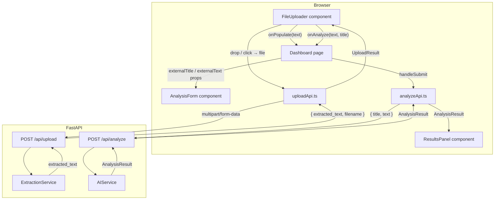

# Design Document: File Upload

## Overview

This feature adds a file upload pipeline to the Semantic Validator application. Users can upload PDF, DOCX, TXT, or Excel files; the backend extracts plain text from the file and returns it to the frontend. The frontend then lets the user either populate the existing `AnalysisForm` with the extracted text (for review/editing) or trigger analysis immediately.

The implementation touches three layers:

1. **Backend** — a new `POST /api/upload` endpoint and a new `ExtractionService` with format-specific parsers.
2. **Frontend API layer** — a new `uploadFile` function in `src/api/`.
3. **Frontend UI layer** — a new `FileUploader` component and state-coordination changes in `Dashboard` and `AnalysisForm`.

The design preserves the existing `POST /api/analyze` contract and the existing `AnalysisForm` / `ResultsPanel` behaviour. All new UI elements follow the established `slate-900` / white-card / `blue-600` design language.

---

## Architecture



**Key design decisions:**

- The upload endpoint is completely decoupled from `/api/analyze`. Extraction and analysis are separate concerns and separate HTTP calls.
- `Dashboard` owns the shared state (`externalTitle`, `externalText`) that bridges `FileUploader` and `AnalysisForm`. Neither child component knows about the other.
- `AnalysisForm` is extended with optional controlled props (`externalTitle`, `externalText`). When these are provided, the component syncs its internal state to them via `useEffect`, preserving backward compatibility.
- File size and MIME-type validation happen on both the frontend (before the request) and the backend (as a second line of defence).

---

## Components and Interfaces

### Backend

#### `ExtractionService` (`backend/app/services/extraction_service.py`)

```python
class ExtractionService:
    MAX_FILE_SIZE: int = 10 * 1024 * 1024  # 10 MB

    SUPPORTED_MIME_TYPES: frozenset[str] = frozenset({
        "application/pdf",
        "application/vnd.openxmlformats-officedocument.wordprocessingml.document",
        "text/plain",
        "application/vnd.openxmlformats-officedocument.spreadsheetml.sheet",
        "application/vnd.ms-excel",
    })

    def extract(self, filename: str, content_type: str, data: bytes) -> str:
        """
        Dispatch to the appropriate parser based on content_type.
        Returns a plain-text string (may be empty).
        Raises ValueError for unsupported types.
        Raises ExtractionError for parse failures.
        """

    def _extract_txt(self, data: bytes) -> str: ...
    def _extract_pdf(self, data: bytes) -> str: ...
    def _extract_docx(self, data: bytes) -> str: ...
    def _extract_excel(self, data: bytes) -> str: ...
```

Custom exceptions:

```python
class ExtractionError(Exception):
    """Raised when a supported-format file cannot be parsed."""

class UnsupportedFileTypeError(ValueError):
    """Raised when the MIME type is not in SUPPORTED_MIME_TYPES."""
```

#### Upload Router (`backend/app/routers/upload.py`)

```python
@router.post("/api/upload", response_model=UploadResult)
async def upload_file(file: UploadFile = File(...)) -> UploadResult:
    ...
```

Error mapping:

| Condition | HTTP status |
|---|---|
| Unsupported MIME type | 422 |
| File > 10 MB | 413 |
| `ExtractionError` | 500 |

#### New Pydantic schemas (`backend/app/models/schemas.py` additions)

```python
class UploadResult(BaseModel):
    extracted_text: str
    filename: str
```

---

### Frontend

#### `uploadApi.ts` (`frontend/src/api/uploadApi.ts`)

```typescript
export interface UploadResult {
  extracted_text: string;
  filename: string;
}

export async function uploadFile(file: File): Promise<UploadResult>
```

Mirrors the error-handling pattern of `analyzeApi.ts`: Axios errors with a `detail` field are re-thrown as plain `Error` instances; network failures produce a user-friendly message.

#### `FileUploader` component (`frontend/src/components/FileUploader.tsx`)

Props:

```typescript
interface FileUploaderProps {
  onPopulate: (text: string) => void;
  onAnalyze: (text: string, fallbackTitle: string) => void;
  isAnalyzing: boolean;   // disables action buttons while analysis is running
}
```

Internal state machine:

```
idle → dragging (dragover)
idle → uploading (file selected/dropped)
uploading → success (upload resolves)
uploading → error (upload rejects)
error → idle ("Try Again" clicked)
success → idle ("Try Again" clicked)
```

```typescript
type UploaderState =
  | { status: "idle" }
  | { status: "dragging" }
  | { status: "uploading" }
  | { status: "success"; result: UploadResult }
  | { status: "error"; message: string };
```

#### `AnalysisForm` changes

New optional props added to `AnalysisFormProps`:

```typescript
interface AnalysisFormProps {
  onSubmit: (title: string, text: string) => void;
  isLoading: boolean;
  externalTitle?: string;   // NEW — controlled from Dashboard
  externalText?: string;    // NEW — controlled from Dashboard
}
```

A `useEffect` syncs internal state when these props change:

```typescript
useEffect(() => {
  if (externalTitle !== undefined) setTitle(externalTitle);
}, [externalTitle]);

useEffect(() => {
  if (externalText !== undefined) setText(externalText);
}, [externalText]);
```

The component remains fully functional without these props (backward compatible).

#### `Dashboard` changes

New state:

```typescript
const [externalTitle, setExternalTitle] = useState<string | undefined>();
const [externalText, setExternalText]   = useState<string | undefined>();
const [truncationWarning, setTruncationWarning] = useState(false);
const analysisFormRef = useRef<HTMLDivElement>(null);
```

`handlePopulate(text: string)`:
1. Truncate to 5000 chars if needed; set `truncationWarning`.
2. Set `externalText`.
3. Scroll `analysisFormRef` into view.

`handleAnalyze(text: string, fallbackTitle: string)`:
1. Truncate to 5000 chars if needed; set `truncationWarning`.
2. Set `externalText` and (if `externalTitle` is empty) `externalTitle` to `fallbackTitle`.
3. Call `handleSubmit` with the resolved title and truncated text.

---

## Data Models

### Backend schemas

```python
# Existing (unchanged)
class AnalyzeRequest(BaseModel):
    title: str = Field(..., min_length=1, max_length=200)
    text:  str = Field(..., min_length=1, max_length=5000)

class AnalysisResult(BaseModel):
    meaning:       str
    tone:          str
    clarity_score: int  = Field(..., ge=0, le=100)
    suggestions:   list[str] = Field(..., min_length=1, max_length=5)

# New
class UploadResult(BaseModel):
    extracted_text: str
    filename:       str
```

### Frontend types (`frontend/src/types.ts` additions)

```typescript
export interface UploadResult {
  extracted_text: string;
  filename: string;
}

export type UploaderState =
  | { status: "idle" }
  | { status: "dragging" }
  | { status: "uploading" }
  | { status: "success"; result: UploadResult }
  | { status: "error"; message: string };
```

### API contract — `POST /api/upload`

**Request** — `multipart/form-data`

| Field | Type | Constraints |
|---|---|---|
| `file` | binary | Required; max 10 MB; MIME type must be a Supported_Format |

**Success response** — `200 OK`

```json
{
  "extracted_text": "...",
  "filename": "report.pdf"
}
```

**Error responses**

| Status | Condition | `detail` example |
|---|---|---|
| 413 | File > 10 MB | `"File size exceeds the 10 MB limit."` |
| 422 | Unsupported MIME type | `"Unsupported file type: application/zip. Accepted types: pdf, docx, txt, xls, xlsx."` |
| 500 | Parse failure | `"Failed to extract text from report.pdf: ..."` |


---

## Correctness Properties

*A property is a characteristic or behavior that should hold true across all valid executions of a system — essentially, a formal statement about what the system should do. Properties serve as the bridge between human-readable specifications and machine-verifiable correctness guarantees.*

### Property 1: Extraction always produces a string

*For any* file whose MIME type is a Supported_Format, calling `ExtractionService.extract()` SHALL return a `str` value (never `None`, never raise an unhandled exception).

**Validates: Requirements 2.6**

---

### Property 2: Extraction completeness

*For any* supported-format file constructed with a known set of text tokens (paragraphs, cells, or raw bytes), every token that was written into the file SHALL appear somewhere in the extracted result string.

This property covers all four parsers:
- TXT: every line written appears in the output.
- PDF: every page's text appears in the output.
- DOCX: every paragraph appears in the output.
- Excel: every non-empty cell value appears in the output.

**Validates: Requirements 2.1, 2.2, 2.3, 2.4**

---

### Property 3: Upload endpoint rejects unsupported MIME types

*For any* file whose `content_type` is not in `ExtractionService.SUPPORTED_MIME_TYPES`, the `POST /api/upload` endpoint SHALL return HTTP 422 with a non-empty `detail` string that identifies the unsupported type.

**Validates: Requirements 1.3**

---

### Property 4: Upload response shape for supported files

*For any* valid supported-format file, the `POST /api/upload` endpoint SHALL return HTTP 200 with a JSON body containing a `filename` string equal to the uploaded filename and an `extracted_text` string.

**Validates: Requirements 1.2**

---

### Property 5: Text truncation invariant

*For any* `extracted_text` string produced by a successful upload, when the user activates either "Populate Form" or "Analyze", the text written into `AnalysisForm` SHALL be `extracted_text[:5000]` — i.e., exactly `min(len(extracted_text), 5000)` characters. When `len(extracted_text) > 5000`, a truncation warning SHALL also be displayed.

**Validates: Requirements 4.2, 4.3, 5.2**

---

### Property 6: Filename-without-extension as fallback title

*For any* uploaded filename of the form `<name>.<ext>`, when the user activates "Analyze" and the `AnalysisForm` title field is empty, the title submitted to the analysis API SHALL equal `<name>` (the filename with its last extension removed).

**Validates: Requirements 5.3**

---

### Property 7: Preview is first 300 characters

*For any* `extracted_text` string returned by a successful upload, the preview text displayed in `FileUploader` SHALL equal `extracted_text.slice(0, 300)`.

**Validates: Requirements 3.5**

---

### Property 8: Unsupported file type blocks upload

*For any* `File` object whose MIME type is not a Supported_Format, dropping or selecting it in `FileUploader` SHALL not invoke `uploadFile` and SHALL display a non-empty inline error message.

**Validates: Requirements 3.6**

---

### Property 9: Server error message is surfaced verbatim

*For any* error `detail` string returned by the server in a non-2xx response, `FileUploader` SHALL display that exact string in its inline error banner.

**Validates: Requirements 6.1**

---

### Property 10: Try Again resets to idle state

*For any* error state of `FileUploader` (server error or network failure), clicking the "Try Again" button SHALL transition the component to the `idle` state with no filename, no preview text, and no error message visible.

**Validates: Requirements 6.3, 6.4**

---

## Error Handling

### Backend

| Layer | Error | Handling |
|---|---|---|
| Upload router | File > 10 MB | Return 413 before reading body |
| Upload router | Unsupported MIME type | `UnsupportedFileTypeError` → 422 |
| Upload router | `ExtractionError` | → 500 with message |
| Upload router | Unexpected exception | → 500 with generic message |
| Extraction service | Empty/blank file | Return `""` (no exception) |
| Extraction service | Corrupt PDF/DOCX/Excel | Raise `ExtractionError` |
| Extraction service | Non-UTF-8 TXT | Attempt UTF-8 with `errors="replace"`, return result |

### Frontend

| Scenario | Behaviour |
|---|---|
| File with unsupported extension selected/dropped | Inline error; no HTTP request made |
| Server returns 413 | Display `detail` from response |
| Server returns 422 | Display `detail` from response |
| Server returns 500 | Display `detail` from response |
| Network failure (no response) | Display `"Upload failed. Please check your connection and try again."` |
| Extracted text > 5000 chars | Truncate silently + show truncation warning banner |
| Analysis fails after "Analyze" action | Existing `ResultsPanel` error state handles it |

---

## Testing Strategy

### Backend unit tests (`backend/tests/test_extraction_service.py`)

- **Property tests** (using `hypothesis`):
  - Property 1: `given(supported_format_file())` → `extract()` always returns `str`.
  - Property 2: `given(txt_with_tokens())` → all tokens in result; same for PDF, DOCX, Excel using in-memory file builders.
  - Property 3: `given(unsupported_mime_type())` → `POST /api/upload` returns 422 with non-empty detail.
  - Property 4: `given(supported_format_file())` → `POST /api/upload` returns 200 with `filename` and `extracted_text`.
- **Example tests**:
  - File exactly at 10 MB limit → 200; file at 10 MB + 1 byte → 413.
  - `ExtractionService` mock raises `ExtractionError` → endpoint returns 500.
  - Empty TXT/PDF/DOCX/Excel → returns `""`.

### Frontend unit tests (`frontend/src/__tests__/FileUploader.test.tsx`)

- **Property tests** (using `fast-check`):
  - Property 5: `fc.string()` as `extracted_text` → text in form is `text.slice(0, 5000)`; warning shown iff `len > 5000`.
  - Property 6: `fc.tuple(fc.string(), fc.string())` as `[name, ext]` → title is `name` when form title is empty.
  - Property 7: `fc.string()` as `extracted_text` → preview equals `text.slice(0, 300)`.
  - Property 8: `fc.string()` filtered to non-supported MIME → `uploadFile` not called, error shown.
  - Property 9: `fc.string()` as server `detail` → displayed verbatim.
  - Property 10: any error state → Try Again → idle with no filename/preview/error.
- **Example tests**:
  - Dragover → highlighted border class applied.
  - Drop → `uploadFile` called.
  - Upload in progress → loading indicator shown, input disabled.
  - Successful upload → "Populate Form" and "Analyze" buttons rendered.
  - `isAnalyzing=true` → both action buttons disabled.
  - Network failure → fixed fallback message shown.

### Integration tests

- `POST /api/upload` with a real PDF, DOCX, TXT, and Excel file → verify `extracted_text` is non-empty and `filename` matches.
- CORS headers on `/api/upload` match those on `/api/analyze`.

### Property test configuration

- Minimum **100 iterations** per property test.
- Each property test tagged with a comment: `// Feature: file-upload, Property N: <property_text>`
- Backend: `hypothesis` with `settings(max_examples=100)`.
- Frontend: `fast-check` with `{ numRuns: 100 }`.
