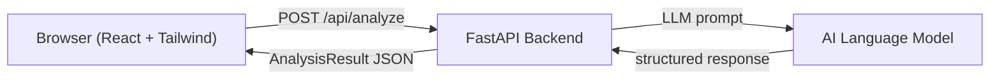
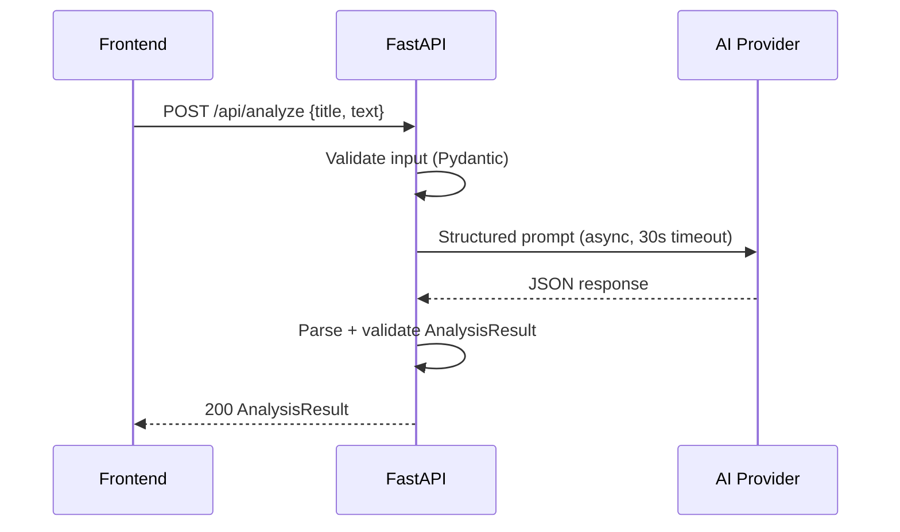

# Design Document: Semantic Validator

## Overview

Semantic Validator is a full-stack web application that accepts user-submitted text (title + body) and returns an AI-powered semantic analysis: a meaning summary, tone classification, clarity score, and improvement suggestions.

The system is split into two independently deployable layers:

- **Frontend**: React SPA with Tailwind CSS, served statically
- **Backend**: FastAPI service that orchestrates AI analysis and exposes a REST API

The frontend communicates with the backend exclusively via the `/api/analyze` endpoint. The backend delegates all AI work to an external language model (e.g., OpenAI, Anthropic, or a compatible API).



---

## Architecture

### Frontend

A single-page React application bootstrapped with Vite. Tailwind CSS handles all styling. React Router manages navigation (currently one route: `/`).

Key design decisions:
- **No global state library** — local component state + React Context is sufficient for this scope
- **Axios** for HTTP requests (consistent error handling, interceptors)
- **Error Boundary** at the app root to satisfy Requirement 8.3

### Backend

A FastAPI application with a single route. The service is stateless — no database is required. All persistence is in-browser (clipboard, session state).

Key design decisions:
- **Pydantic v2** for request/response validation (FastAPI native)
- **httpx AsyncClient** for non-blocking calls to the AI provider
- **asyncio.wait_for** to enforce the 30-second timeout (Requirement 2.4)
- **CORS middleware** configured for the frontend origin

### AI Integration

The backend constructs a structured prompt and sends it to the AI provider. The response is parsed into the `AnalysisResult` schema. The prompt instructs the model to return valid JSON, and the backend validates the parsed output against the Pydantic model.



---

## Components and Interfaces

### Frontend Components

```
App
├── ErrorBoundary          # Catches unhandled render errors (Req 8.3)
├── Navbar                 # Brand link + active-page indicator (Req 4)
└── Dashboard              # Main page (Req 5)
    ├── AnalysisForm       # Title + body inputs, submit button (Req 1)
    │   ├── CharCounter    # Live character count per field (Req 1.4)
    │   └── FieldError     # Inline validation messages (Req 1.3)
    └── ResultsPanel       # Displays analysis output (Req 2.3, 3.2)
        ├── PlaceholderState   # Empty state before first submission (Req 5.2)
        ├── LoadingState       # Spinner + disabled submit (Req 5.3)
        ├── ErrorState         # Human-readable error display (Req 8.1, 8.2)
        └── AnalysisResult     # Meaning, tone, clarity, suggestions (Req 5.4)
            └── SuggestionItem # Clickable suggestion with clipboard copy (Req 3.3)
```

#### AnalysisForm Props

```ts
interface AnalysisFormProps {
  onSubmit: (title: string, text: string) => void;
  isLoading: boolean;
}
```

#### ResultsPanel Props

```ts
type PanelState =
  | { status: "idle" }
  | { status: "loading" }
  | { status: "success"; result: AnalysisResult }
  | { status: "error"; message: string };

interface ResultsPanelProps {
  state: PanelState;
}
```

### Backend Modules

```
app/
├── main.py          # FastAPI app, CORS, router registration
├── routers/
│   └── analyze.py   # POST /api/analyze handler
├── services/
│   └── ai_service.py  # AI provider client, prompt construction, response parsing
├── models/
│   └── schemas.py   # Pydantic request/response models
└── config.py        # Settings (AI API key, timeout, CORS origin)
```

#### analyze.py handler signature

```python
@router.post("/api/analyze", response_model=AnalysisResult)
async def analyze(request: AnalyzeRequest) -> AnalysisResult:
    ...
```

#### ai_service.py interface

```python
async def analyze_text(title: str, text: str) -> AnalysisResult:
    """
    Sends a structured prompt to the AI provider.
    Raises AITimeoutError on timeout, AIServiceError on provider error.
    """
```

---

## Data Models

### API Request

```python
class AnalyzeRequest(BaseModel):
    title: str = Field(..., min_length=1, max_length=200)
    text: str = Field(..., min_length=1, max_length=5000)
```

### API Response

```python
class AnalysisResult(BaseModel):
    meaning: str
    tone: str
    clarity_score: int = Field(..., ge=0, le=100)
    suggestions: list[str] = Field(..., min_length=1, max_length=5)
```

### Error Response

FastAPI's default 422 body is used for validation errors. For AI errors, the backend returns:

```python
class ErrorResponse(BaseModel):
    detail: str
```

HTTP 504 — AI timeout  
HTTP 502 — AI provider error  
HTTP 422 — Request validation failure

### Frontend TypeScript Types

```ts
interface AnalysisResult {
  meaning: string;
  tone: string;
  clarity_score: number;   // 0–100
  suggestions: string[];   // 1–5 items
}

interface AnalyzeRequest {
  title: string;
  text: string;
}
```

---

## Correctness Properties

*A property is a characteristic or behavior that should hold true across all valid executions of a system — essentially, a formal statement about what the system should do. Properties serve as the bridge between human-readable specifications and machine-verifiable correctness guarantees.*

### Property 1: Invalid input rejection

*For any* request body where the title or body is empty, composed entirely of whitespace, or exceeds the maximum character limit (200 for title, 5000 for body), the backend SHALL respond with HTTP 422, and the frontend SHALL display an inline validation error and block submission.

**Validates: Requirements 1.3, 1.4, 7.3**

### Property 2: Analysis result completeness

*For any* valid (title, text) pair accepted by the backend, the returned `AnalysisResult` SHALL contain a non-empty `meaning` string, a non-empty `tone` string, a `clarity_score` in the range [0, 100], and a `suggestions` list with between 1 and 5 non-empty strings.

**Validates: Requirements 2.2, 3.1, 7.2**

### Property 3: Result display completeness

*For any* `AnalysisResult` value, the results panel SHALL render the `meaning`, `tone`, `clarity_score`, and every item in `suggestions` as visible, distinct elements in the UI.

**Validates: Requirements 2.3, 3.2, 5.4**

### Property 4: Suggestion clipboard round-trip

*For any* suggestion string displayed in the results panel, clicking that suggestion SHALL invoke `navigator.clipboard.writeText` with that exact string.

**Validates: Requirements 3.3**

### Property 5: AI timeout produces 504

*For any* valid request where the AI provider does not respond within 30 seconds, the backend SHALL return HTTP 504 with a descriptive error message.

**Validates: Requirements 2.4**

### Property 6: AI provider error produces 502

*For any* valid request where the AI provider returns an error response, the backend SHALL return HTTP 502 with a descriptive error message.

**Validates: Requirements 2.5**

### Property 7: Backend error triggers UI error display

*For any* error response (4xx or 5xx) received from the backend, the results panel SHALL display a human-readable error message rather than a blank or broken state.

**Validates: Requirements 8.1**

### Property 8: Unhandled frontend error triggers fallback UI

*For any* unhandled exception thrown during React rendering, the ErrorBoundary SHALL render a fallback error state rather than a blank or broken page.

**Validates: Requirements 8.3**

---

## Error Handling

| Scenario | Backend response | Frontend display |
|---|---|---|
| Empty/missing fields | 422 Unprocessable Entity | Inline field error |
| Field exceeds max length | 422 Unprocessable Entity | Character counter + blocked submit |
| AI provider timeout (>30s) | 504 Gateway Timeout | Error state in results panel |
| AI provider error | 502 Bad Gateway | Error state in results panel |
| Network failure (no response) | — | "Service unavailable, please retry" |
| Unhandled frontend exception | — | ErrorBoundary fallback UI |

The backend uses two custom exception classes:

```python
class AITimeoutError(Exception): ...
class AIServiceError(Exception): ...
```

These are caught in the route handler and mapped to the appropriate HTTP status codes via FastAPI exception handlers.

---

## Testing Strategy

### Unit Tests (Backend)

- `AnalyzeRequest` Pydantic validation: empty fields, over-limit fields, valid fields
- `AnalysisResult` Pydantic validation: out-of-range clarity score, wrong suggestion count
- `ai_service.analyze_text`: mock AI provider responses, verify correct parsing
- Exception mapping: `AITimeoutError` → 504, `AIServiceError` → 502

### Unit Tests (Frontend)

- `AnalysisForm`: submit blocked when fields empty or over limit; character counter updates
- `ResultsPanel`: renders each state (idle, loading, success, error) correctly
- `SuggestionItem`: clipboard write called with correct text on click

### Property-Based Tests (Backend — pytest + Hypothesis)

Each property test runs a minimum of 100 iterations.

- **Property 1**: Generate strings of varying length and whitespace composition for title and body; assert Pydantic raises `ValidationError` for invalid inputs (empty, whitespace-only, over-limit) and accepts valid ones.
  - *Feature: semantic-validator, Property 1: invalid input rejection*

- **Property 2**: Generate random valid (title, text) pairs; mock the AI provider to return a plausible JSON blob; assert the parsed `AnalysisResult` always satisfies schema invariants (score in [0,100], suggestion count in [1,5], non-empty strings).
  - *Feature: semantic-validator, Property 2: analysis result completeness*

- **Property 5**: Mock the AI provider to always time out; generate random valid requests; assert the handler always returns 504.
  - *Feature: semantic-validator, Property 5: AI timeout produces 504*

- **Property 6**: Mock the AI provider to always raise an error; generate random valid requests; assert the handler always returns 502.
  - *Feature: semantic-validator, Property 6: AI provider error produces 502*

### Property-Based Tests (Frontend — Vitest + fast-check)

Each property test runs a minimum of 100 iterations.

- **Property 3**: Generate random `AnalysisResult` objects; render `ResultsPanel`; assert `meaning`, `tone`, `clarity_score`, and every suggestion string appear as visible elements.
  - *Feature: semantic-validator, Property 3: result display completeness*

- **Property 4**: Generate arbitrary suggestion strings; simulate click on `SuggestionItem`; assert `navigator.clipboard.writeText` was called with the exact string.
  - *Feature: semantic-validator, Property 4: suggestion clipboard round-trip*

- **Property 7**: Generate various HTTP error responses (4xx, 5xx) with arbitrary messages; assert `ResultsPanel` renders a human-readable error message.
  - *Feature: semantic-validator, Property 7: backend error triggers UI error display*

- **Property 8**: Generate components that throw arbitrary errors during render; assert `ErrorBoundary` renders the fallback UI rather than propagating the crash.
  - *Feature: semantic-validator, Property 8: unhandled frontend error triggers fallback UI*

### Integration Tests

- End-to-end: POST `/api/analyze` with a real (or stubbed) AI response; assert full response shape.
- CORS: verify `Access-Control-Allow-Origin` header is present for the configured origin.
- Responsive layout: Playwright viewport tests at 320px, 768px, 1280px.
