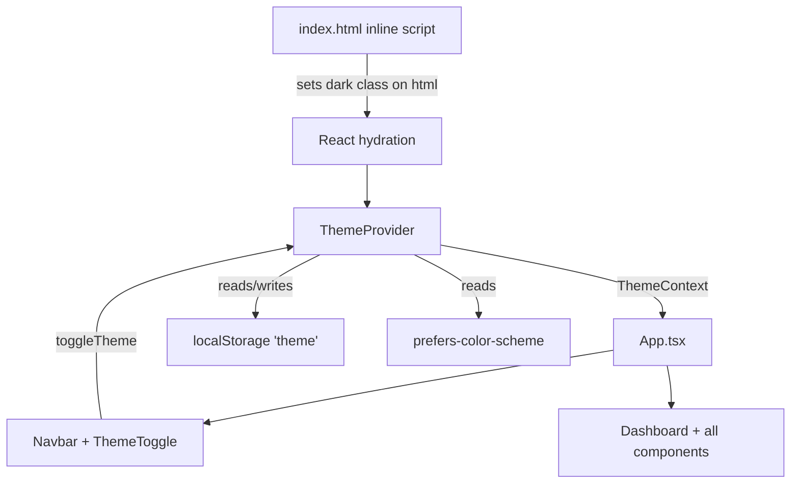

# Design Document: Theme System

## Overview

This document describes the technical design for adding a light/dark theme system to the Semantic Validator frontend. The implementation uses Tailwind CSS's `darkMode: 'class'` strategy, a React `ThemeContext` with a `useTheme` hook, a flash-prevention inline script, and dark mode Tailwind variants applied to all 11 existing components.

The design prioritizes:
- **Zero flash on load** — theme is applied before React hydrates via an inline `<script>` in `index.html`
- **Clean API** — a single `useTheme()` hook gives any component access to the current theme and toggle function
- **Full coverage** — every component gets `dark:` Tailwind variants; no component is left in light-only mode
- **Graceful degradation** — `localStorage` unavailability (private browsing) is handled without throwing

---

## Architecture



**Initialization flow:**

1. Browser parses `index.html` → inline script runs synchronously
2. Script reads `localStorage.getItem('theme')`, falls back to `matchMedia('(prefers-color-scheme: dark)')`, falls back to `'light'`
3. If dark: adds `class="dark"` to `<html>`; if light: ensures no `dark` class
4. React loads → `ThemeProvider` mounts, reads the same priority order to set its internal state
5. `ThemeProvider` keeps React state and the `<html>` class in sync on every toggle

---

## Components and Interfaces

### New Files

#### `frontend/src/context/ThemeContext.tsx`

```typescript
type Theme = 'light' | 'dark';

interface ThemeContextValue {
  theme: Theme;
  toggleTheme: () => void;
}

// ThemeProvider: wraps the app, manages state, syncs html class + localStorage
export function ThemeProvider({ children }: { children: React.ReactNode }): JSX.Element

// useTheme: consumes ThemeContext; throws if called outside ThemeProvider
export function useTheme(): ThemeContextValue
```

**State initialization logic** (used by both the inline script and `ThemeProvider`):

```
function resolveInitialTheme(): Theme {
  try {
    const stored = localStorage.getItem('theme');
    if (stored === 'dark' || stored === 'light') return stored;
  } catch { /* localStorage unavailable */ }
  if (window.matchMedia?.('(prefers-color-scheme: dark)').matches) return 'dark';
  return 'light';
}
```

**`applyTheme(theme)` helper** (called on every theme change):

```
function applyTheme(theme: Theme): void {
  document.documentElement.classList.toggle('dark', theme === 'dark');
  try { localStorage.setItem('theme', theme); } catch { /* ignore */ }
}
```

#### `frontend/src/components/ThemeToggle.tsx`

A single icon button rendered inside `Navbar`. Displays:
- **Moon icon** when `theme === 'light'` (clicking will switch to dark)
- **Sun icon** when `theme === 'dark'` (clicking will switch to light)

```typescript
export default function ThemeToggle(): JSX.Element
// Uses useTheme() internally — no props needed
```

### Modified Files

| File | Change |
|---|---|
| `frontend/tailwind.config.js` | Add `darkMode: 'class'` |
| `frontend/index.html` | Add inline `<script>` before `</head>` for flash prevention |
| `frontend/src/App.tsx` | Wrap with `ThemeProvider`; add `dark:bg-zinc-900` to root div |
| `frontend/src/components/Navbar.tsx` | Add `dark:bg-zinc-950`; render `<ThemeToggle />` |
| `frontend/src/pages/Dashboard.tsx` | Add dark variants to page header text and card wrappers |
| `frontend/src/components/AnalysisForm.tsx` | Dark variants for card, inputs, labels, textarea |
| `frontend/src/components/ResultsPanel.tsx` | Dark variants for card, text, banners, progress bar |
| `frontend/src/components/FileUploader.tsx` | Dark variants for drop zone, states, banners |
| `frontend/src/components/BeforeAfterPanel.tsx` | Dark variants for card, panels, buttons |
| `frontend/src/components/ExcelDashboard.tsx` | Dark variants for card, tabs, table, stat cards |
| `frontend/src/components/SuggestionItem.tsx` | Dark variants for border, bg, text |
| `frontend/src/components/CharCounter.tsx` | Dark variant for muted text color |
| `frontend/src/components/FieldError.tsx` | No change needed (red-500 works on both themes) |
| `frontend/src/components/ErrorBoundary.tsx` | Dark variants for full-screen bg and card |

---

## Data Models

### Theme Type

```typescript
type Theme = 'light' | 'dark';
```

### ThemeContext Value

```typescript
interface ThemeContextValue {
  theme: Theme;        // current active theme
  toggleTheme: () => void;  // switches theme, persists to localStorage, updates html class
}
```

### localStorage Schema

| Key | Values | Description |
|---|---|---|
| `"theme"` | `"light"` \| `"dark"` | Persisted user preference |

### Tailwind Dark Mode Configuration

```javascript
// tailwind.config.js
export default {
  darkMode: 'class',   // ← added
  content: ["./index.html", "./src/**/*.{js,ts,jsx,tsx}"],
  theme: { extend: {} },
  plugins: [],
};
```

---

## Dark Color Palette Mapping

| Element | Light class | Dark variant |
|---|---|---|
| Page background | `bg-slate-50` | `dark:bg-zinc-900` |
| Card/panel surface | `bg-white` | `dark:bg-zinc-800` |
| Card/panel border | `border-slate-200` | `dark:border-zinc-700` |
| Primary text | `text-slate-800` | `dark:text-slate-100` |
| Secondary text | `text-slate-500` | `dark:text-slate-400` |
| Muted/label text | `text-slate-400` | `dark:text-zinc-500` |
| Navbar background | `bg-slate-900` | `dark:bg-zinc-950` |
| Input background | (white/transparent) | `dark:bg-zinc-800` |
| Input border | `border-slate-300` | `dark:border-zinc-600` |
| Input text | `text-slate-800` | `dark:text-slate-100` |
| Placeholder | `placeholder-slate-400` | `dark:placeholder-zinc-500` |
| Hover row/item | `hover:bg-slate-50` | `dark:hover:bg-zinc-700` |
| Subtle bg (slate-50 panels) | `bg-slate-50` | `dark:bg-zinc-800/50` |
| Table header bg | `bg-slate-50` | `dark:bg-zinc-800` |
| Table divider | `divide-slate-100` | `dark:divide-zinc-700` |
| Progress bar track | `bg-slate-100` | `dark:bg-zinc-700` |
| Blue primary button | `bg-blue-600 hover:bg-blue-700` | unchanged (good contrast on dark) |
| Error banner | `bg-red-50 border-red-200 text-red-700` | `dark:bg-red-900/30 dark:border-red-800 dark:text-red-300` |
| Warning banner | `bg-yellow-50 border-yellow-200 text-yellow-700` | `dark:bg-yellow-900/30 dark:border-yellow-800 dark:text-yellow-300` |
| Success badge | `bg-green-100 text-green-700` | `dark:bg-green-900/30 dark:text-green-300` |

---

## Flash Prevention

The inline script is placed inside `<head>` in `index.html`, before any stylesheets or module scripts, so it runs synchronously before the browser paints:

```html
<script>
  (function () {
    try {
      var t = localStorage.getItem('theme');
      if (t === 'dark' || (!t && window.matchMedia('(prefers-color-scheme: dark)').matches)) {
        document.documentElement.classList.add('dark');
      }
    } catch (e) {}
  })();
</script>
```

This is an IIFE to avoid polluting the global scope. The `try/catch` handles `localStorage` being blocked in private browsing. No `else` branch is needed because the `<html>` element has no `dark` class by default.

---

## Component-by-Component Dark Class Additions

### App.tsx
```
bg-slate-50 min-h-screen  →  bg-slate-50 dark:bg-zinc-900 min-h-screen
```

### Navbar.tsx
```
bg-slate-900  →  bg-slate-900 dark:bg-zinc-950
```
Add `<ThemeToggle />` in the nav links area.

### Dashboard.tsx (page header + card wrappers)
```
text-slate-800  →  text-slate-800 dark:text-slate-100
text-slate-500  →  text-slate-500 dark:text-slate-400
bg-white rounded-xl ... border-slate-200  →  + dark:bg-zinc-800 dark:border-zinc-700
text-slate-700 uppercase  →  + dark:text-slate-300
bg-yellow-50 border-yellow-200 text-yellow-700  →  + dark:bg-yellow-900/30 dark:border-yellow-800 dark:text-yellow-300
```

### AnalysisForm.tsx
```
bg-white ... border-slate-200  →  + dark:bg-zinc-800 dark:border-zinc-700
text-slate-800 (heading)  →  + dark:text-slate-100
text-slate-700 (label)  →  + dark:text-slate-300
border-slate-300 text-slate-800 placeholder-slate-400  →  + dark:bg-zinc-800 dark:border-zinc-600 dark:text-slate-100 dark:placeholder-zinc-500
```

### ResultsPanel.tsx
```
bg-white ... border-slate-200  →  + dark:bg-zinc-800 dark:border-zinc-700
bg-slate-100 (icon bg)  →  + dark:bg-zinc-700
text-slate-400 (icon)  →  + dark:text-zinc-500
text-slate-500 (idle text)  →  + dark:text-slate-400
text-slate-800 (heading)  →  + dark:text-slate-100
text-slate-400 (section labels)  →  + dark:text-zinc-500
text-slate-700 (body text)  →  + dark:text-slate-300
bg-slate-100 (progress track)  →  + dark:bg-zinc-700
bg-red-50 border-red-200  →  + dark:bg-red-900/30 dark:border-red-800
text-red-700  →  + dark:text-red-300
```

### FileUploader.tsx
```
border-slate-300 bg-slate-50 (drop zone)  →  + dark:border-zinc-600 dark:bg-zinc-800/50
text-slate-400 (icon/text)  →  + dark:text-zinc-500
text-slate-700 (label)  →  + dark:text-slate-300
border-slate-200 bg-slate-50 (uploading)  →  + dark:border-zinc-700 dark:bg-zinc-800/50
text-slate-600 (uploading text)  →  + dark:text-slate-400
text-slate-700 (filename)  →  + dark:text-slate-300
bg-slate-50 border-slate-200 (preview)  →  + dark:bg-zinc-800 dark:border-zinc-700
text-slate-600 (preview text)  →  + dark:text-slate-400
border-slate-400 text-slate-700 hover:bg-slate-50 (deduplicate btn)  →  + dark:border-zinc-500 dark:text-slate-300 dark:hover:bg-zinc-700
bg-red-50 border-red-200 text-red-700  →  + dark:bg-red-900/30 dark:border-red-800 dark:text-red-300
```

### BeforeAfterPanel.tsx
```
bg-white ... border-slate-200  →  + dark:bg-zinc-800 dark:border-zinc-700
bg-slate-100 text-slate-600 (no-dup badge)  →  + dark:bg-zinc-700 dark:text-slate-300
bg-slate-100 border-slate-200 (original header)  →  + dark:bg-zinc-700 dark:border-zinc-600
border-slate-200 bg-slate-50 (original pre)  →  + dark:border-zinc-700 dark:bg-zinc-800/50
text-slate-700 (pre text)  →  + dark:text-slate-300
text-slate-400 (count)  →  + dark:text-zinc-500
bg-red-50 border-red-200 text-red-700  →  + dark:bg-red-900/30 dark:border-red-800 dark:text-red-300
```

### ExcelDashboard.tsx
```
bg-white ... border-slate-200 (card)  →  + dark:bg-zinc-800 dark:border-zinc-700
text-slate-800 (heading)  →  + dark:text-slate-100
border-slate-200 (header border)  →  + dark:border-zinc-700
border-transparent text-slate-500 hover:text-slate-700 hover:bg-slate-50 (inactive tab)  →  + dark:text-slate-400 dark:hover:text-slate-200 dark:hover:bg-zinc-700
border-blue-600 text-blue-600 bg-blue-50 (active tab)  →  + dark:bg-blue-900/30
bg-slate-50 border-slate-200 (StatCard)  →  + dark:bg-zinc-700 dark:border-zinc-600
text-slate-400 (StatCard label)  →  + dark:text-zinc-500
text-slate-800 (StatCard value)  →  + dark:text-slate-100
bg-slate-50 border-b border-slate-200 (table thead)  →  + dark:bg-zinc-700 dark:border-zinc-600
text-slate-500 (th text)  →  + dark:text-slate-400
divide-slate-100 (tbody)  →  + dark:divide-zinc-700
hover:bg-slate-50 (tr hover)  →  + dark:hover:bg-zinc-700
text-slate-800 (cell primary)  →  + dark:text-slate-100
text-slate-600 (cell secondary)  →  + dark:text-slate-400
text-slate-300 italic (null)  →  + dark:text-zinc-600
border-slate-300 (filter input)  →  + dark:bg-zinc-800 dark:border-zinc-600 dark:text-slate-100 dark:placeholder-zinc-500
border-slate-300 (pagination btns)  →  + dark:border-zinc-600 dark:text-slate-300 dark:hover:bg-zinc-700
text-slate-500 (pagination text)  →  + dark:text-slate-400
border-slate-200 (AI summary border)  →  + dark:border-zinc-700
text-slate-700 (AI summary text)  →  + dark:text-slate-300
text-slate-400 italic (AI unavailable)  →  + dark:text-zinc-500
bg-red-50 border-red-200 text-red-700  →  + dark:bg-red-900/30 dark:border-red-800 dark:text-red-300
border-slate-300 text-slate-700 hover:bg-slate-50 (dismiss btn)  →  + dark:border-zinc-600 dark:text-slate-300 dark:hover:bg-zinc-700
```

### SuggestionItem.tsx
```
border-slate-200 bg-slate-50 hover:bg-blue-50 hover:border-blue-200  →  + dark:border-zinc-700 dark:bg-zinc-800/50 dark:hover:bg-blue-900/20 dark:hover:border-blue-700
text-slate-400 group-hover:text-blue-500  →  + dark:text-zinc-500
text-slate-700  →  + dark:text-slate-300
```

### CharCounter.tsx
```
text-slate-400  →  text-slate-400 dark:text-zinc-500
```

### ErrorBoundary.tsx
```
bg-slate-50 (full screen)  →  + dark:bg-zinc-900
bg-white ... border-red-100 (card)  →  + dark:bg-zinc-800 dark:border-red-900/50
text-slate-800 (heading)  →  + dark:text-slate-100
text-slate-500 (error message)  →  + dark:text-slate-400
```

---

## Correctness Properties

*A property is a characteristic or behavior that should hold true across all valid executions of a system — essentially, a formal statement about what the system should do. Properties serve as the bridge between human-readable specifications and machine-verifiable correctness guarantees.*

### Property 1: HTML class invariant

*For any* theme value (`"light"` or `"dark"`), after `applyTheme(theme)` is called, the presence of the `"dark"` class on `document.documentElement` must equal `(theme === "dark")`.

**Validates: Requirements 1.4, 1.5, 2.4**

---

### Property 2: Toggle is its own inverse

*For any* starting theme value, calling `toggleTheme()` twice must return the theme to its original value (i.e., `toggle(toggle(theme)) === theme`).

**Validates: Requirements 2.2**

---

### Property 3: Persistence round-trip

*For any* theme value, after `applyTheme(theme)` is called, `localStorage.getItem("theme")` must return that same theme value.

**Validates: Requirements 2.3, 5.1**

---

### Property 4: Initialization reads stored preference

*For any* stored theme value in `localStorage`, `resolveInitialTheme()` must return that stored value (when it is a valid `"light"` or `"dark"` string).

**Validates: Requirements 1.1, 5.2**

---

### Property 5: Toggle icon matches theme

*For any* theme value, the `ThemeToggle` component must render a sun icon when `theme === "dark"` and a moon icon when `theme === "light"`.

**Validates: Requirements 2.1**

---

### Property 6: aria-label describes the action

*For any* theme value, the `ThemeToggle` button's `aria-label` must be a non-empty string that references the opposite theme (i.e., contains "dark" when current theme is "light", and "light" when current theme is "dark").

**Validates: Requirements 2.5**

---

## Error Handling

| Scenario | Handling |
|---|---|
| `localStorage` blocked (private browsing) | `try/catch` in both inline script and `resolveInitialTheme()`; falls back to OS preference or light default |
| `useTheme()` called outside `ThemeProvider` | Throws `Error("useTheme must be used within a ThemeProvider")` |
| `matchMedia` unavailable (old browser/SSR) | Optional chaining `window.matchMedia?.()` returns `undefined`; treated as no OS preference |
| Invalid stored value in `localStorage` | Only `"light"` and `"dark"` are accepted; any other value falls through to OS preference |

---

## Testing Strategy

### Unit Tests (example-based)

- `resolveInitialTheme()` with stored `"dark"` → returns `"dark"`
- `resolveInitialTheme()` with stored `"light"` → returns `"light"`
- `resolveInitialTheme()` with no stored value + OS dark → returns `"dark"`
- `resolveInitialTheme()` with no stored value + OS light → returns `"light"`
- `resolveInitialTheme()` with no stored value + no OS preference → returns `"light"`
- `resolveInitialTheme()` with invalid stored value → falls through to OS preference
- `useTheme()` outside `ThemeProvider` → throws descriptive error
- `ThemeProvider` renders children and provides `{ theme, toggleTheme }` via context
- `localStorage` blocked → `resolveInitialTheme()` does not throw

### Property-Based Tests

Property-based testing is applicable here because the theme system has pure logic functions (`applyTheme`, `resolveInitialTheme`, `toggleTheme`) whose correctness properties hold across all valid inputs. The input space (theme values, localStorage states) is small but the invariants are universal.

**Library:** [fast-check](https://github.com/dubzzz/fast-check) (already compatible with Vitest)

**Minimum iterations:** 100 per property test

Each property test is tagged with a comment referencing the design property:
`// Feature: theme-system, Property N: <property_text>`

**Property tests to implement:**

1. **HTML class invariant** — generate arbitrary `Theme` values, call `applyTheme(theme)`, assert `document.documentElement.classList.contains('dark') === (theme === 'dark')`
   - Tag: `Feature: theme-system, Property 1: HTML class invariant`

2. **Toggle is its own inverse** — generate arbitrary `Theme` values, call toggle twice, assert result equals original
   - Tag: `Feature: theme-system, Property 2: Toggle is its own inverse`

3. **Persistence round-trip** — generate arbitrary `Theme` values, call `applyTheme(theme)`, assert `localStorage.getItem('theme') === theme`
   - Tag: `Feature: theme-system, Property 3: Persistence round-trip`

4. **Initialization reads stored preference** — generate arbitrary valid `Theme` values, set in localStorage, call `resolveInitialTheme()`, assert result matches stored value
   - Tag: `Feature: theme-system, Property 4: Initialization reads stored preference`

5. **Toggle icon matches theme** — generate arbitrary `Theme` values, render `ThemeToggle` with that theme in context, assert correct icon is present
   - Tag: `Feature: theme-system, Property 5: Toggle icon matches theme`

6. **aria-label describes the action** — generate arbitrary `Theme` values, render `ThemeToggle`, assert `aria-label` is non-empty and references the opposite theme
   - Tag: `Feature: theme-system, Property 6: aria-label describes the action`

### Integration / Smoke Tests

- Verify `tailwind.config.js` has `darkMode: 'class'`
- Verify inline script is present in `index.html` before `</head>`
- Verify `ThemeProvider` wraps the app in `App.tsx`
- Snapshot tests for each component in both light and dark mode (using `ThemeProvider` with forced theme value)
